# 2021李宏毅机器学习课程

## 第一部分、绪论

### 1.什么是机器学习

***

机器学习就是 --- ` 找函式`

例如，输入一段音频 --> 通过一个函式 --> 得到音频的内容。

1. 有监督学习

   * 回归问题 --> 输出一个数字

   * 分类问题 --> 输出属于哪一类

     ` 除了回归问题和分类问题机器学习领域其实还有很多其他问题，我们最终除了得到一个结果(数字/分类)，还要得到一些其他的结果文件。`

2. 无监督学习

   * 聚类问题

### 2.相关知识

***

#### 1）机器学习基本步骤

1.**Model：** 实际上就是带有未知参数的函式，例如 Y = b + w*X1

2.**Loss：**损失函数是函式参数的函式，可以用来描述模型有多好，越大越不好，越小越好。
$$
L = 1 / N \times \sum_n e_n
$$

**label：** label就是正确的结果。

**MAE：** Loss是绝对误差。
$$
e = |y - \widehat{y}|
$$

**MSE：** Loss是平方误差。
$$
e = (y - \widehat{y})^2
$$

注意：如果以上的方法效果不好有时也会考虑交叉熵损失：Cross-entropy

3.**Optimization：**优化更新函式里面的参数，上例中就是更新w和b

梯度下降：

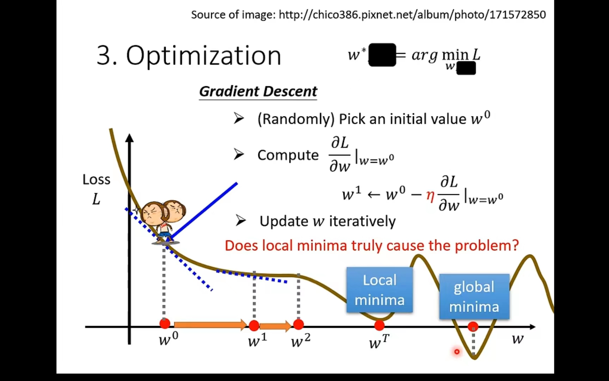

图中的Loss有负数是因为损失函数是自己设定的也许我可以设定损失函数最后-100，就会导致结果变成负数。

注意：我们梯度下降方向与斜率反向，并且斜率越大移动距离越小，斜率越小移动距离越大。

#### 2）model bias

由于线性模型总是直线所以对于某些不是直线的问题会存在无法避免的偏差问题。

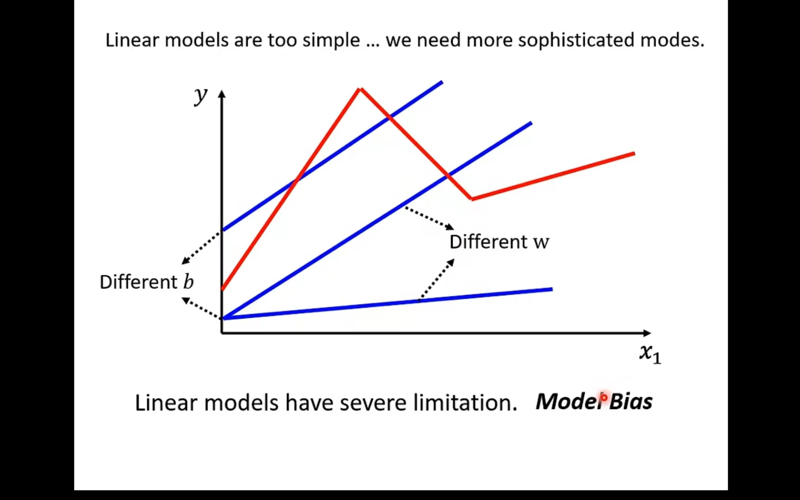

**解决方案：**

red curve红色曲线 = constant + sum of a set of 曲线

就是把目标曲线按照转折点**`用若干个线段`**进行拼接最终表示出来。

这一堆线段函数表示为：
$$
y = c \times  {1 \over 1+e^{-(b+wx_1)}}
  = c \times sigmoid(b + wx_1)
$$

c：是个常数

如果X_1非常大的话那么最终的值就会趋近于c，如果X_1非常小的话那么最终值就会趋近于0。--- sigmoid函数

通过调整不同的`c，b，w`我们就可以得到不同的sigmoid函数。

修改w：更改斜率

修改b：平移

修改c：修改高度

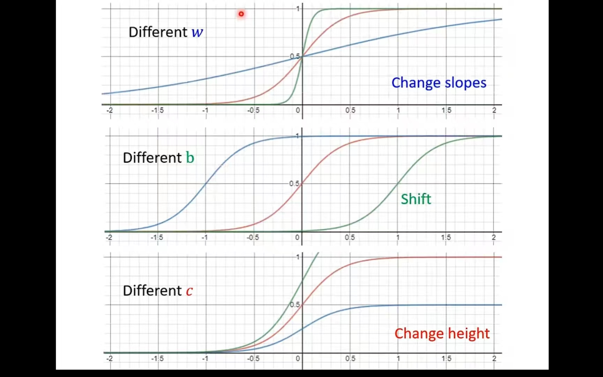

所以如果我们用多段线段来表示`函式(model)`我们可以表示y = b + wx1为：

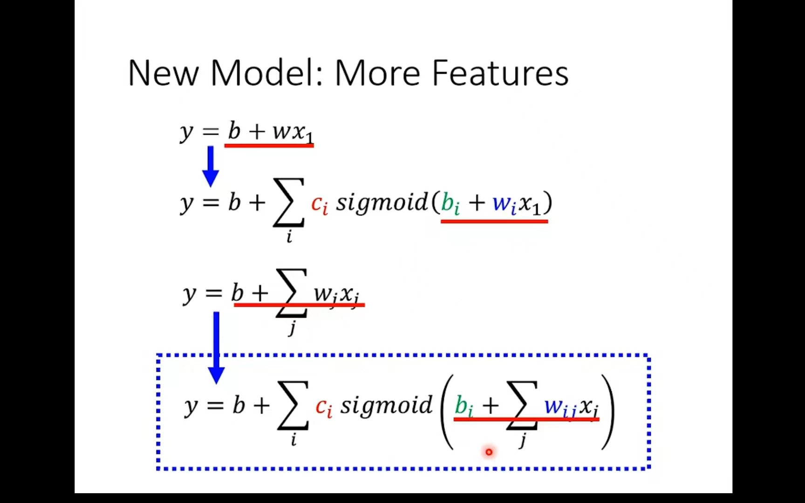

若用`矩阵形式`表示则为下图左边所示，如果用`图示`表示就是下图右边所示：

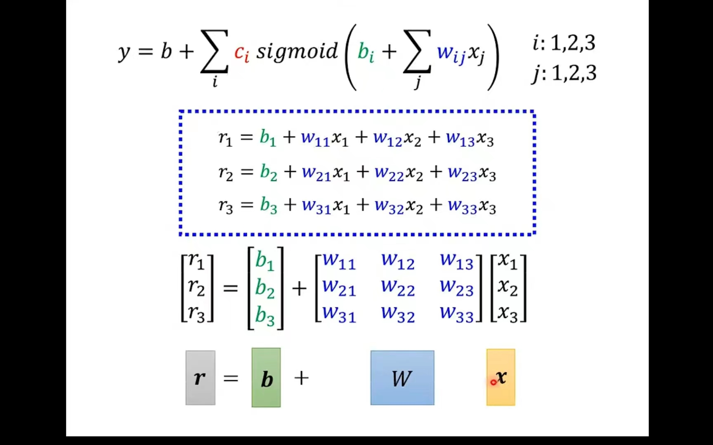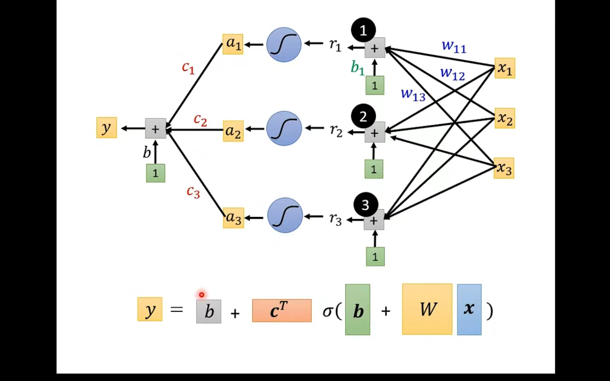

此时未知参数数量变多，用θ来表示，所以梯度下降就是对θ的更新：

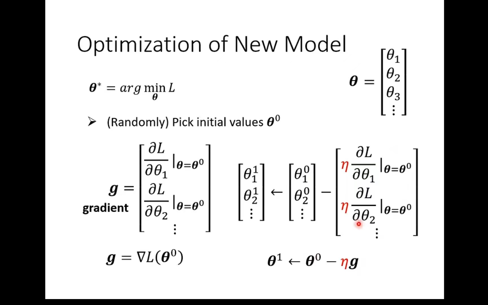

对于给出的数据集使用分批(epoch)进行读取：

注意：1次epoch指的是该批次中的全部batchs的一次运行，而每一个batchs都需要update

所以例子中1epoch中update更新次数如下所示：

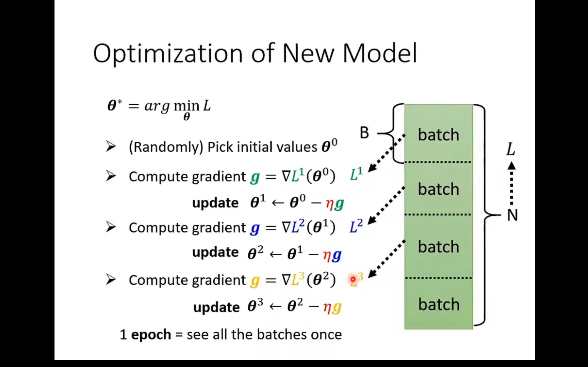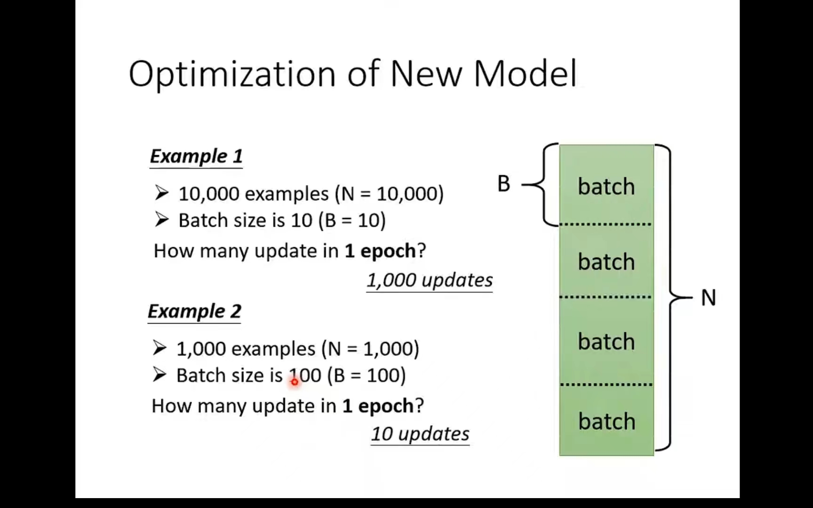

#### 3）其他的激活函数

例如下图所示的`ReLU函数`，我们可以看出sigmoid函数可以用两个ReLU函数进行组合而成。

所以我们修改之前的`函数(model)`就可以得到使用ReLU函数的式子。

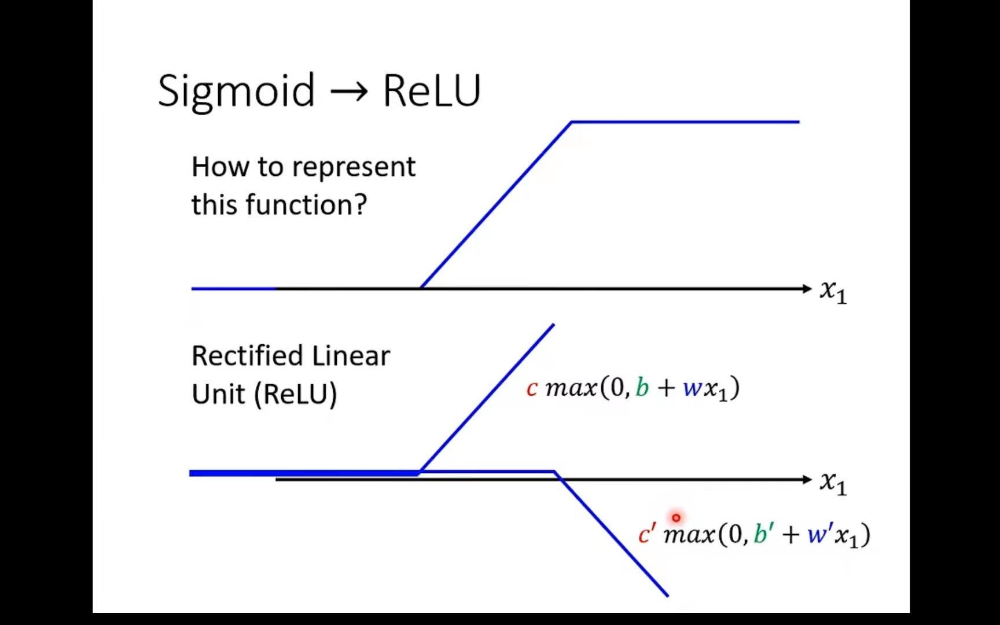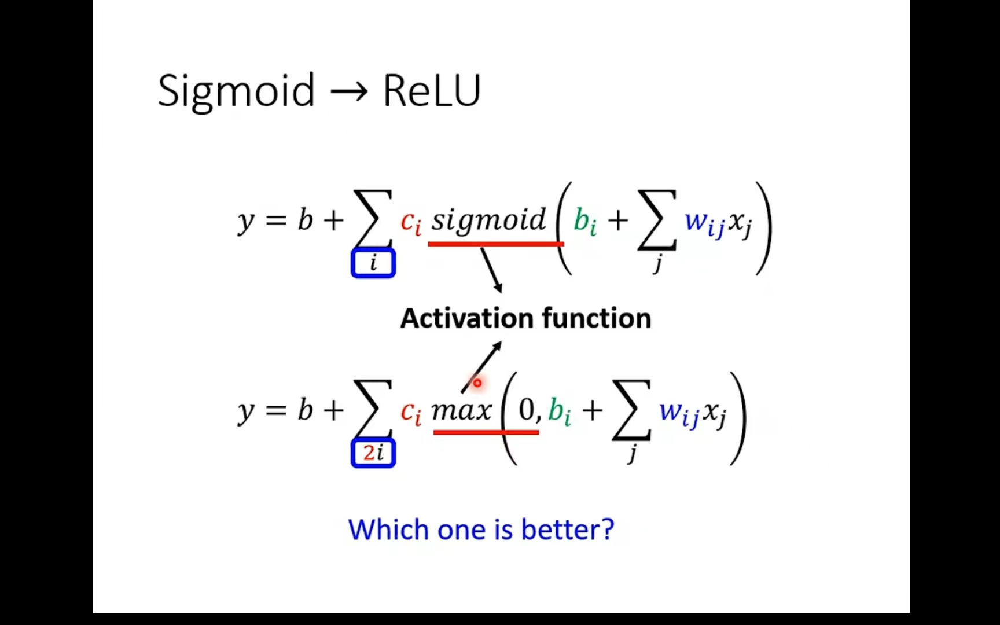

#### 4）再次修改模型

我们可以在之前的模型后再加一层sigmoid或者ReLU，将原来的部分当作a输入a'中，而且我们可以反复多做几次这个过程。

上述的模型就是`神经网络`，其中的每个sigmoid函数可以称为是一个`神经元`，后来我们把每一排的神经元称为一个`隐藏层`，所有隐藏层合到一起就是一个`深度学习`。

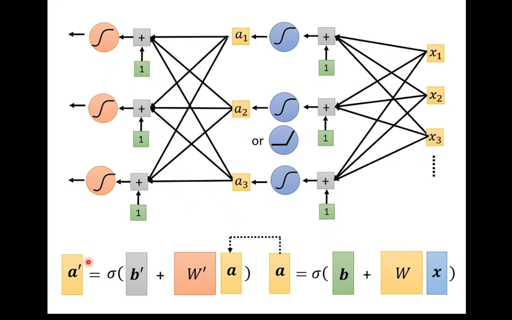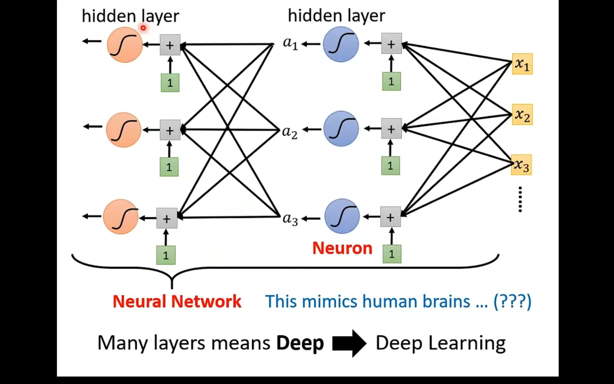