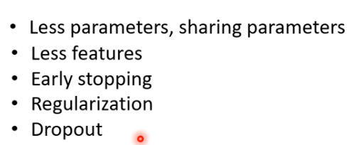

# 2021李宏毅机器学习课程

## 第二部分、训练集调整

### 1.作业攻略（模型搭建流程）

***

**`下图是整个机器学习任务中训练集所可能遇到的各种问题：`**

1. 当训练误差较大时可能是模型设计的不合理(model bias)导致的偏差过大，或者是因为优化器设计的不好。
   * 我们可以通过修改模型使得模型更加复杂(比如添加sigmoid或者ReLU)解决model bias的训练误差大。
   * 下一节学如何解决优化器问题。
2. 当训练误差小时，我们认为模型不错，当投入测试集发现误差较大时，也许是过拟合，也可能是训练集和测试集较大程度的不匹配(mismatch)。
   * 当过拟合发生时我们可以选择
     * 使用更多的训练数据来使得模型更加精确，即减少由于之前训练数据少而导致有些点的预测结果是随机生成的问题。
     * 111
   * 当出现mismatch时需要我们对训练集和测试集有较为清晰的认识才能解决，后面会学。
3. 验证集的引入，我们可以将已知的数据集划分为训练集和验证集，通过训练集训练数据产生不同的模型，结果放到验证集去验证，取在各种情况下平均误差值最小的模型作为最终模型，拿最终模型放到整个数据集作为训练集训练之后，放到测试集去测试。这样可以避免在作业提供的公共测试集上由于随机结果产生误差小但是在真实测试集上误差大的问题。

**图中的流程在下面的各部分均有详细的展示：**

#### 1）model bias / optimization

下图是`model bias`的问题，我们的虽然从构建的各个模型中找到了Loss最小的模型，但是他并不是实际上最小的。

下图是优化器`optimization`效果不好的问题，我们的优化器不能支撑我们优化得到最小的损失函数的模型。

当我们不知道我们的模型是不是足够复杂、是不是足够大的时候我们可以测试看看。

例如：

56层的模型可以轻而易举做到20层模型能做到的事情(后36层什么也不做就相当于是20层模型)

但是结果发现56层的训练误差更大，所以只可能是优化器不够好。

#### 2）overfitting

下图表示的是`过拟合(Overfitting)`的问题，也就是当模型不复杂时(如图左)我们根据训练集找到比较小的Loss时，应用在测试集效果也很好。

但是当我们的模型变得更复杂(能够更加精确的拟合训练集)，但是对于没有见过的数据会产生随机的预测结果，所以当使用测试集时，我们会发现由于测试集的实际预测结果和我们之前随机生成的不一致，从而导致了测试集误差很大。

解决过拟合问题我们可以使用增加训练集的数量，如下图所示，当训练集增多时，我们的模型自己产生随机预测值的部分就会减少，模型就会被限制住，就可以避免过拟合的产生。

下图所示就是我们增加训练集的一种方式，但是最后一种不符合实际情况(没有小猫是倒着的)，这种图片如果放入训练集那么结果一定会变差。

解决过拟合问题的另一种方式，就是直接去限制模型，比如直接限制模型为二次函数，也许我们就会得到比较好测试的结果。

限制模型我们可以使用较少的参数，比如深度学习我们可以减少神经元的数量，或者共用参数(CNN部分有提到)

但是我们的模型不能限制太过不然就会出现下图的问题，由过拟合变成model bias。

所以我们的目标就是得到训练集和测试集loss都小的模型。

#### 3）validation

验证集的引入，为了解决训练集训练的结果直接放到作业中给出的public test中也许会随机出好的结果，但是并不能随机到private test中产生好的结果的问题，我们引入验证集，这样我们当在public test上发现loss大的时候我们就可以返回训练集去调整模型参数，直到在public test上loss满足的时候，再放入private test中，这样最终不会出现在public test上误差小而private test上误差大的问题。下图右边是`验证集划分`和使用的一些方法。

#### 4）mismatch

如下图所示，由于训练集和测试集本身的不同，也许会导致大误差的问题。

### 2.local minima 与 saddle point

***

**当我们使用优化器的时候有时会出现优化器效果不好的状况，其中一种原因就是由于local minima 和 saddle point 的原因。**

观察上图我们可以发现，local minima 和 saddle point 都会导致梯度下降时出现导数为零的情况而停止继续的参数更新，但是此时的Loss还没有达到我们想要的值。

#### 1）泰勒方法逼近L(θ)

这种方法就是针对于θ'逼近θ时，使用两部分来完成，其中绿色方框中的部分是用梯度(`一次导数`)，红色方框中的部分是用`二次导数`。

其中梯度得到的g是一个向量，而二次求导之后得到的H是一个矩阵。

这样做的好处就是当我们处于local minima 或者 saddle point的时候，梯度为零，但是红色框中的二次导数不为零，从而我们还可以继续参数更新。

#### 2）区分local minima/local max/saddle point

如上图所示，当我们已经处于梯度为零的点时，我们假设θ - θ' 用v来表示，当vT H v > 0 的时候，也就是此时的θ'是周围点中最小的点，我们就说此时θ'是`local max`。

同理，当vT H v < 0 的时候，θ'所在位置是`local minima`。

当θ'附近有大于零也有小于零的点时，θ'所在位置是`saddle point`。

如果用线性代数加以推导的话我们可以发现，当vT H v > 0 的时候，H的`特征值`均为正数。当vT H v < 0 的时候，H的特征值均为负数，所以我们也可以根据二次导数得出的H的特征值来判断此时为什么样的critical point。

例如：

下图所示的误差曲面(Error surface)中，中间为saddle point，而两侧均为local minima。

注：图中每一条线上的loss均相同，没有线的部分表示loss为零。

当我们使用前面的泰勒逼近的方法进行操作，我们就可以很轻易的得出中间的是saddle point，过程如下图所示。如果一个点已经判定为是一个鞍点(saddle point)的话，我们也可以根据所求得的H矩阵来得出接下来应该去`移动的方向`。

但是，我们不能随时都去计算二次导数所以这种方式我们用的非常少。

#### 3）梯度等于零的情况

如图所示当移动过程中除了遇到saddle point 和 local minima之外，当处于非常平缓的地带也会使得梯度趋近于，从而停止移动。

#### 4）small batch/large batch

之前已经提到过batch的概念，也就是我们把一个大的数据集进行划分之后我们可以每部分作为一个batch进行一次update。

那么batch大小的选取会有什么影响如下图所示。

也就是说当batch小的时候虽然更新会很快，但是当我们的硬件(gpu)能够满足并行运算时，batch划分的大还是小时间是差不多的。

对于梯度而言，因为小的batch梯度下降过程中是不同的(noisy)，所以就可能会避开由于梯度过小而停止移动的问题。所以对于优化器来说small batch 的优化效果更好。

而对于泛化能力(可以理解为在测试集上的表现)，也是small batch比较好，因为当batch比较大的我们倾向于走入峡谷中，因为small batch每次方向修改的比较快，更可能会停留在平原而不会停在峡谷。（正在研究中的一个问题）

#### 5）Momentum(SGDM)

`Momentum`是用于解决local minima的一种方法。

如上图所示常规的`梯度下降(SGD)`是沿着斜率的反方向进行下降。

而`引入momentum的优化器(SGDM)`是在基础梯度下降的基础上参考了之前的每次移动，来合力作用得出下降的方向。也就是可以理解为是一种运动中的`惯性`。

我们期望的结果就是使用之前累计的`惯性`来冲出local minima。

#### 6）different learning rate(RMSProop)

由于我们梯度下降停止也许不止是由于梯度值过小引起，而是遇到了一个无法跳出的深坑。

例如上图所示当我们从起点向较为平坦的地方前进的时候我们应该需要较大的学习率，而当我们向较为陡峭的地方前进的时候我们需要较小的学习率。

对于我们之前一直使用的η，我们在他下面除以了一个另外的值，这个值与i有关，也就是没一次下降都有各自相应的学习率。

后来考虑到每次移动和之前并不是完全均等的关系，所以提出了另一种方式--`RMSProp`，这种方式添加了α作为权重。同样的我们在遇到`陡峭`的地方的时候通过增大分母从而减小步伐，遇到`平坦`的地方我们减小分母从而增大步伐。

如果使用原来的没有调整适应的学习率到时候结果就是如下图所示，无法到达目标位置。

当我们使用调整适应后的学习率，我们可以到达目标位置，左图有一些来回飞的情况可能是在平原走到时间过长，从而分母过小导致的移动方向激增，但是后来激增到一定程度又会减小回来。

#### 7）Adam优化器

adam优化器就是综合了SGDM和RMSProop之后的优化器

#### 8）Warm up黑科技

影片中提到了一种名为warm up的学习率调整方法，即先增加后下降，在某些时候也许会产生非常好的结果。

### 3.Batch Normalization(归一化)

***

#### 1）归一化引入

由于数据集数据的差异以及环境的随时变化，我们有时会用一组较小的值作为输入，有时会用一组较大的值作为输入，但是我们最终都是想让他们有相类似的结果。所以就引入了`数据归一化`的概念。

对于特征x的归一化我们通常使用`x - 均值(m) / 方差`。使用了归一化之后梯度下降速度也会有明显的提升。

#### 2）Deep learning中的归一化

对于一个`深度学习`的架构我们也常常使用归一化的思想。

#### 3）batch normalization(批归一化)

如下图所示我们直到之前的x1~,x2~,x3~都是分别使用数据归一化得出的结果，而后续结果中的z1,z2,z3是相互间有关联的使用的`批归一化`。

#### 4）在测试集中使用批归一化

由于我们不知道测试集的数据有多少所以不能使用之前的方法，等一个批次排满了才开始运行测试即，所以我们使用之前训练集最终得出的平均μ-和🤖-(方差)作为测试集中归一化的`均值`和`方差`。

结果就是使用了归一化的方法(红色虚线)达到`最佳accuracy(准确率)`的速度会快很多。

### 4.简述分类问题

***

相比较于之前的回归问题，分类问题最终的结果不是一个数，而是一个类别。

#### 1）one-hot编码

我们可以使用`one - hot编码`来对分类结果进行表示，如下图所示。

#### 2）Softmax

相较于回归问题最终比较预测结果和真实结果的差距，在分类问题中我们最后使用`softmax函数`对y进行处理使得最终的向量中的每部分的结果都在0-1之间，然后与用one-hot编码表示的分类结果进行比较判定所属类别。

#### 3）分类问题计算Loss

与回归问题不同，在分类问题中我们使用`交叉熵损失函数`求Loss。

因为使用回归问题中的`MSE损失函数`，梯度下降会停在损失较大的部分，而使用`交叉熵损失函数`，梯度下降损失会逐渐从大向小移动。

