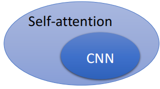
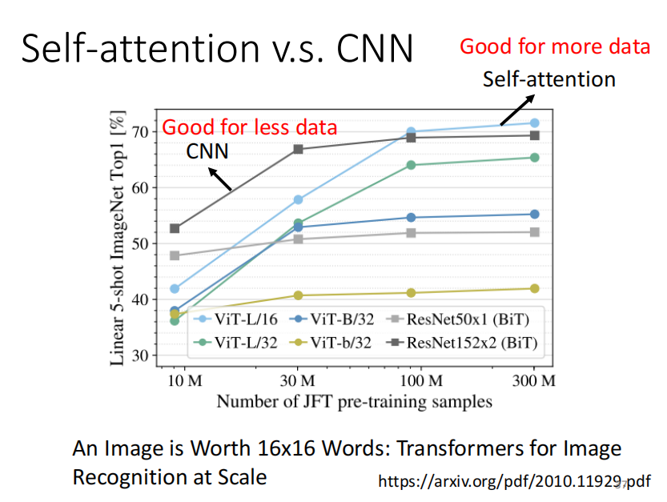

# 2021李宏毅机器学习课程

## 第三部分、Network网络架构

### 1.CNN架构

***

Convolutional Neural Network (CNN)是专门用于做影像辨识的。

在对影像的处理中，我们的`输入是一个向量`。

我们的数据集图片的尺寸大小往往是不一致的，所以在最开始一般`先对图片的大小进行统一`。

以下图的RGB彩色图片为例，图片是由三个channel组成的一个三维的`tensor`(tensor可以理解为是在二维矩阵之上的一种结构)

为了能够把图片数据输入到模型中，我们将图像拉直变成如图右侧所示。

但是如果使用上面右侧的Fully connected network的话所需的参数过多，所以我们考虑使用减少参数的方式，即`简化`。

#### 1）局部连接(感受域)

如上图所示我们并不需要使用全连接的方式(fully connected network)，而是只需要图片中的一小部分我们就可以完成分类任务。

如上图所示我们可以使用`3 x 3的感受域`进行操作，每一个3 x 3的感受域(此时包括3个channel)作为每一个神经元的输入。

我们一般的典型感受域(卷积核)的选取可以按照下图所示。

由于考虑到关键信息可能在交叉部分所以我们可以控制每次移动的`步长`，使之有交叠的移动，最后不够的部分通过`padding补全0`。

我们一般并不只是使用一个神经元负责一个感受域，一般会使用若干个神经元负责同一个感受域，例如上图中的鸟嘴的位置并不在一个位置，但是只要负责这两个感受域的神经元中有识别是否为鸟嘴的部分，我们就可以根据结果判断此图片为鸟类。

#### 2）权值共享

`权值共享`，是减少参数量的一种有效的手段，如右图所示，我们对于不同的感受域可以使用相同的权值(filter)进行计算，因为不同感受域内的值不同，所以虽然权值相同，最终结果也不同。

具体例子：

如上图所示(假设只有一个channel的情况)，每一个filter就是一个`卷积核`，右图是每一部分得出的结果。

这每次的卷积操作的结果称为一个`Feature map`。

注意：每次卷积操作之后的**通道(channel)数与卷积核的数量保持一致**，上图中一共64个卷积核(filter)所以输入3个channel输出是64个channel，**后续的卷积**操作的输入就要是64个channel。

#### 3）池化

`池化的目的就是减少卷积后的图片大小`，包括Max Pooling，Min Pooling，Avg Pooling等等。

例如：

Max Pooling如下图所示。

但是池化并不全是好处，由于池化的操作，我们会损失很多的特征值，所以大部分时候我们考虑不适用池化。

#### 4）完整的CNN架构

如左图所示，在经过了不断的卷积和池化操作之后我们还要经过`Flatten操作`，目的是把卷积最终的结果`拉直`，后续再经过若干次`全连接`，也可能最后经过一个`softmax`，最终得到符合分类要求的一个向量(每部分都在0-1内)。

例如，对一个9类的问题进行分类，我们最终的结果应该是一个(x1,x2,x3,x4,x5,x6,x7,x8,x9)的向量。

右图则表示了cnn架构实际是全连接网络架构的一种细化，所以会存在`model bias`的问题，但是由于cnn一般就是用来做影像辨识的所有问题不大。

#### 5）CNN的问题

cnn无法解决图片放大缩小，旋转等情况下的影响辨识问题。例如下图我们的识别结果可能就会由于图片的放大，感受域无法准确的捕捉特征而出现不一致的情况。通常需要我们对数据集的图片进行`数据增强`。

### 2.Self-attention架构

***

Self-attention架构下我们的输入是`一连串的向量`，并且向量的长短也许是不一致的。

输入有两种形式，一种是one-hot编码，另一种是词的形式。

比如我们可以使用`一串音频、一个关系网、一串化学元素`作为self-attention的输入。

最终我们得到的输出也是与cnn有所区别的。

也许是`一对一`的label输出，也许是最后只输出`一个label`，也许最后输出的结果`由机器自行决定`。

右图是输出一个label的一些例子。

#### 1）窗口思想

由于输入是一串向量，那么如下面的例子输入了一个句子是“I saw a saw.”此时两个saw的词性应该是完全不同的，为了帮助计算机进行判断，我们可以设置一个`窗口`来判断某一个向量和其相邻若干个向量之间的相关关系。

但是有一个问题就是我们的输入向量个数无法确定所以窗口大小没法确定，于是就有了`self-attention架构的"天涯若比邻"`的想法，我们将每一个向量都和其他向量进行计算权重，得出大家的相关性，最终得出结果。

上图中由一组输入的向量经过self-attention得到的`带黑边的向量`其实就是和其他所有向量产生联系之后的结果，然后我们再经过一个`全连接`得到进一步的结果。

当然我们也可以多self-attention几次。

#### 2）计算权重

那么如何用a1，a2，a3，a4，得到相对应的b，就是`计算权重`的过程。

如下图所示，有两种计算权重的方法，我们一般选择第一种Dot-product计算权重。

计算过程如下图所示，这个`softmax`过程可以有也可以没有，具体可以看用和不用的效果决定。

其中q和k是相对应的a和矩阵Wq，Wk做乘法得出来的。

然后对所有α和矩阵v做乘法再求和，得到a1考虑其他所有向量相关性之后的结果b1。

右图b2的计算同理。

如果用`矩阵的形式`表示的话就是如下面几张图所示。

如果将a1，a2，a3，a4简化成I，b1，b2，b3，b4简化成O，结果如下图所示。

如果是要`考虑多个相关性类别`的话只需要分别计算对应的q和k矩阵产生各子的b即可。

最后`综合考虑`多个不同的b得出最终结果。

#### 3）添加未知项

有时由于我们考虑到有`未知项`的存在所以会在需要的未知添加未知项，常见的未知项有sin，cos，embedding等如右图所示。

#### 4）Self-attention v.s. CNN

cnn每次只能考虑到`感受域内`的资讯，而self-attention的每次考量`整张图片`的咨迅，所以cnn其实是self-attention的一种加以限制之后的特例，或者说`cnn是简化的self-attention`。

同时我们发现CNN当训练图片的量逐渐变多的时候其效果会慢慢被self-attention超过。

#### 5）Self-attention v.s. RNN

最重要的是由于self-attention的所有计算都可以是`平行计算`(计算b1与b2之间相互不影响)，所以其执行效率会高与RNN。

另外还有RNN的每一次结果都是基于左边以及输入的结果，而self-attention每个b都是考虑全局的相关性，所以self-attention优于RNN。

(如果使用双向的RNN，那也可以考虑到全局，但是这种情况下RNN想要最右边考虑最左边的向量，他需要让memory一直带着最左边向量逐步运算直到最右边，而self-attention"天涯若比邻"的思想，提供矩阵q和k就很方便实现相互关联)。

