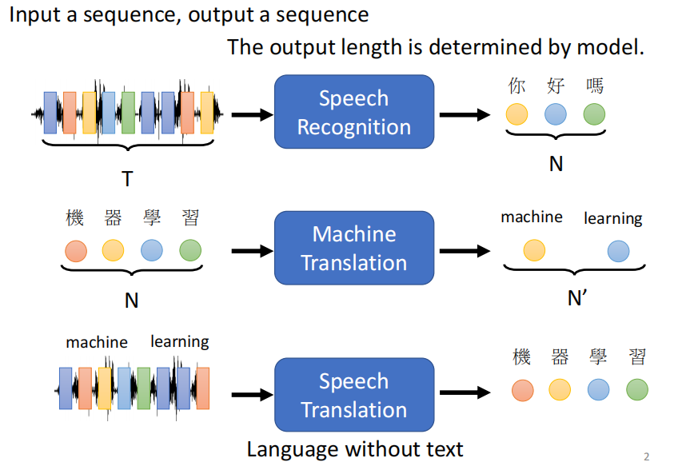

# 2021李宏毅机器学习课程

## 第四部分、Transformer

### 1.Seq2seq

***

`Transformer`就是一个**Sequence-to-sequence (Seq2seq)**的model模型。

seq2seq指的就是输入是一个序列，输出也是一个序列。

如下图所示seq2seq的模型可以用来解决语音识别，机器翻译，语音翻译等功能，并且最终的输出结果有几个由机器来决定。

#### 1）一些应用

对于某些不好去转换的情况，比如输入一段台湾话的音频，将其转化为国语，我们可以`把每一个台湾话对应的国语作为训练集强行训练一次`，也可以得到语音翻译的结果。

我们也可以使用seq2seq实现聊天机器人，如下图所示。

另外的一个常见应用就是用seq2seq实现Q&A的问题，如下图所示。

最后还有一些其他的应用，比如得到语法的树形结构，图像识别，(多相关性)分类问题等等，如下图所示。

#### 2）Encoder

Seq2seq的模型架构主要就是由两部分组成，一部分是处理输入序列的`Encoder`，另一部分是处理输入得到的结果产生输出的`Decoder`。

首先讨论Encoder，如下图所示，Encoder是针对每一个输入的x均会产生相应的结果h，基于这种特点我们就可以使用`CNN`或者`RNN`来进行处理。

如上图左面所示，在`Block`部分使用的是`self-attention`的方式对每个输入的x和其他所有向量产生联系进行处理，得到相对应输出的过程。

如上图右面所示，此时我们使用的是`layer normalization`而不是batch normalization，layer normalization是当我们得到一个结果α之后将其原来的输入向量和α相加组成新的residual(残留)再进行normalization的一种方法。上图右边的右边所示的是当我们有了layer normalization的解果之后，我们拿这个结果进行一次fully connected然后再加上自身进行一次normalization，最终红色边框的结果就是我们通过一层Block之后的一个输出。

这也就是Encoder的内部实现。

注意：最开始输入序列之后的Positional Encoding指的是添加未知项的过程，通过添加未知项可以使得我们的模型应对未知的能力增强。

#### 3）Decoder

然后是Decoder的部分，其中有两种架构分别是`AT(Autoregressive)`和`NAT(Non-autoregressive)`。

##### (1)AT(Autoregressive)

AT的结构是指的是我们将Encoder得到的结果输入到Decoder之后，由一个特殊记号`START`表示开始，然后经过Decoder架构的处理得到一个结果，对结果进行softmax处理使得每一项的概率都处于0-1之间，并且加起来等于1。最后类似`分类问题`，我们根据那一个可能的概率最大得出判断结果。

之后每一次都是用前一步输出的结果作为下一次的输入进行同样的过程。所以如果在过程中有如图所示的错误产生那么后续也可能会产生错误的结果。

我们先在忽略Encoder结果输入Decoder的情况下分析一下Decoder的架构，如下图所示，后续会有完整的Encoder和Decoder的连接图。

在Decoder中我们由于每次考虑的都是在之前每一步基础上进行的分析，所以将之前平行计算的self-attention更改为了基于之前结果(只考虑左边不考虑右边)的`Masked self-attention`架构，可以对照一下上面的忽略Encoder输入的Decoder架构。

例如以b2为例，`self-attention`为下图左，`Marsked self-attention`为下图右。

由于Decoder必须由机器自己决定输出的sequence的长度是多少，否则他可能会无休止的继续下去，所以我们引入了类似之前START标记的概念--`END`。

当我们某一个输入结果得到说END在结果中的概率最大时，我们就停止。

##### (2)NAT(Non-autoregressive)

NAT与AT的不同在于AT是每次的输出结果作为下一次的输入(类似LSTM)，而NAT是在START开始的时候一次性传入一整个句子的资讯，一次性结束(类似self-attention)。

那么NAT如何判断结束有两种方式：

* 在Encoder之后我们得出输出的结果数量，用这个数量控制Decoder产生多少个START。
* 或者如上图所示我们假设他Encoder输出有200个左右，我们可以给他300个START，看那个是END，END之后的部分就舍弃。

NAT的优点就是平行计算比AT快，而且我们可以灵活的设置Decoder的大小，比如在语音合成中我们想让合成快一点就可以让Decoder小一点，想要合成慢一点就可以让Decoder大一点。

但是实际是NAT的效果往往差于AT。--- 其中的一个问题就是Multi-modality。

#### 4）Encoder与Decoder连接

如下图所示，我们可以看到Encoder提供两个箭头作为Decoder的输入，Decoder提供了一个箭头。

具体的过程如下图所示。

而且也并不是说Decoder一定是用Encoder若干次之后的最终结果作为输入，例如下图所示，有很多种不同的Encoder的输入形式。

#### 5）复制机制

我们在实际问题中有的时候一些输入是没有什么逻辑关系的，这是就需要用到`复制机制`。

#### 6）Beam Search(定向搜索)

假设一共就只有A、B两种类别的情况下，我们可以选择红色的每次都选择最优的进行搜索，也可以按照绿色的开始的时候损失一点，后续可能反而能得到更好的结果(有种RL的感觉)。

比如右图所示我们使用Beam Search去预测后续的语句，他得到的最好的情况反而是单纯的语句重复。

