# 2021李宏毅机器学习课程

## 第五部分、自监督式学习(Self-supervised learning)

### 1.Self-supervised learning / Pre-train

***

一个有趣的现象是，BERT相关的模型的命名都是用的芝麻街里的人物名字的简称。

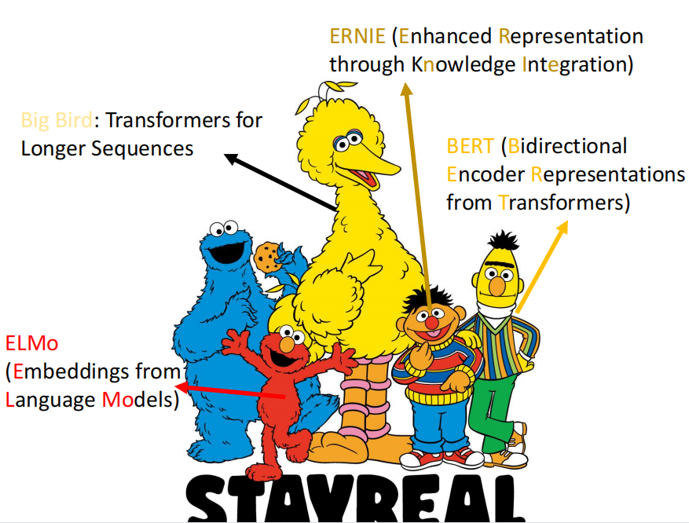

下图所示的是self-supervised learning的结构，与之前学过的回归问题(regression)、分类问题(classification)所属的`有监督学习(supervised learning)`不同的是，self-supervised learning并没有输入x对应的类别标签y，在self-supervised learning种我们通常将输入的x分为两个部分，一部分x'用作输入，另一部分x''用作类别标签，所以综合来说`self-supervised learning属于无监督学习`的一种。

所以使用self-supervised learning我们通常想寻找一些没有标注资料的问题，比如`做填空题`。

`self-supervised learning`也叫做`Pre-train`。

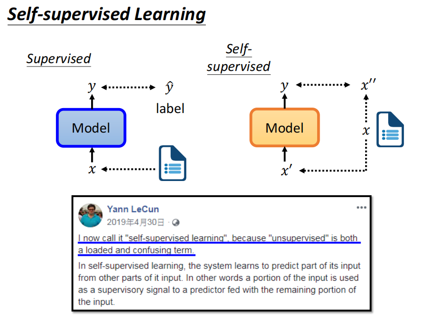

### 2.BERT

***

#### 1）BERT做填空问题

BERT相当于是Seq2seq中的`Encoder`。

BERT的设计是一种屏蔽输入的填空问题，比如下图所示常用的屏蔽输入的某一部分有两种方式：1.用一个特定的字符MASK表示被屏蔽的部分。2.用一些随机生成的其他文字作为屏蔽项(例如，一、天、大、小等等)

BERT也是针对输入产生`相同数量`的输出。

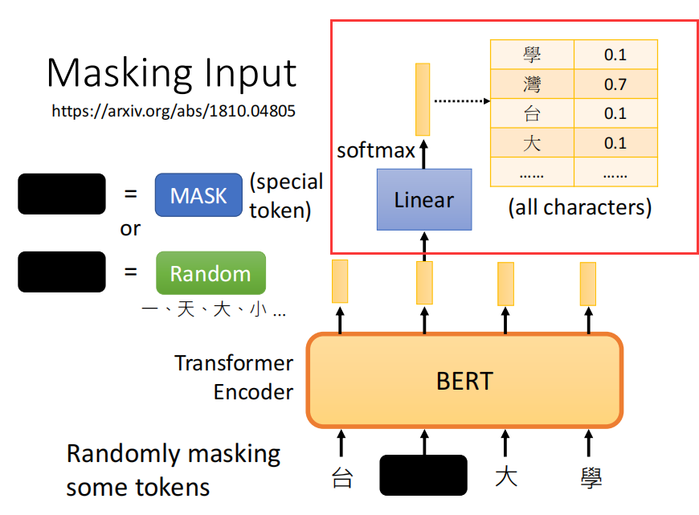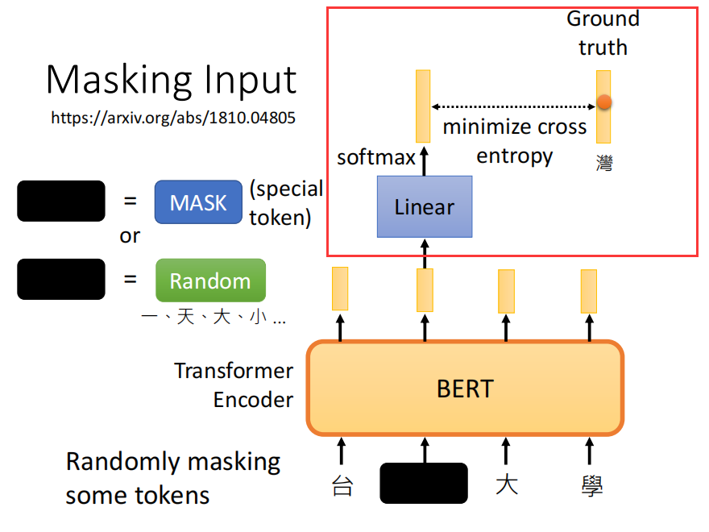

上面两张图右上角的部分就是针对使用了BERT的填空问题，最后也是将输出结果通过一个Linear和softmax计算概率，最后当作是一个分类问题得出预测结果，在将结果和真实结果做交叉熵(cross entropy)得到最后的调整后的填词模型BERT。

#### 2）BERT处理两个句子的连续性

BERT同时也可以用来处理两个句子是否是相连的问题。

注意：对于两个输入的句子我们在前面加[CLS]，中间加[SEP]做分隔。

CLS就是classification的意思，可以理解为用于下游的分类任务。

最后判断两个句子是否应该为相连接的句子，是就输出Yes，不是就输出No。

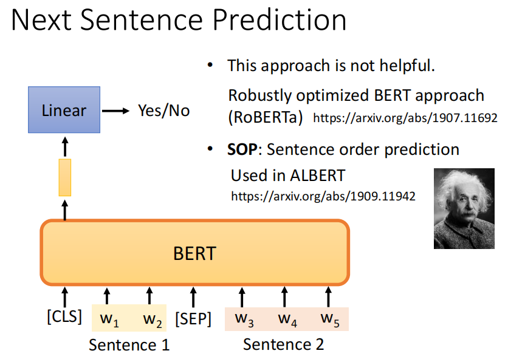

当然BERT不只是能解决填空问题，也可以解决之前涉及到的问题，比如图像辨识，文字处理，语音翻译等等。

BERT称作`Pre-Train`。

这些各种功能都叫做BERT的`下游`(Downstream tasks)，在BERT上加上一些小的数据标签`调整(Fine-tune)`就可以实现各种功能。

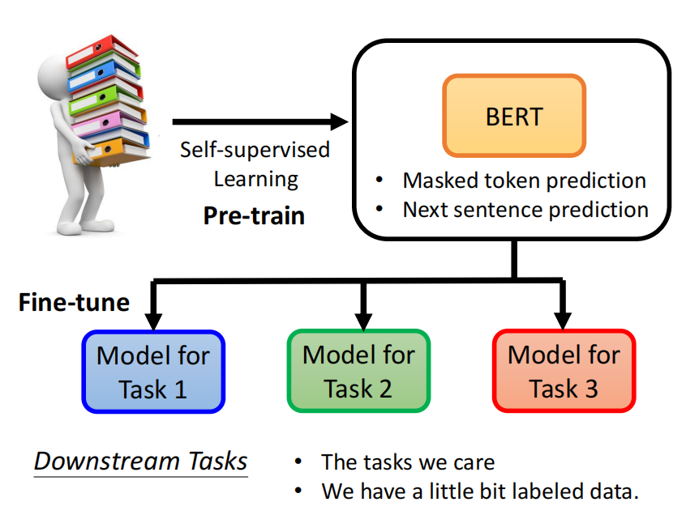

#### 3）GLUE

GLUE是通用语言理解，一般用来评价BERT的效果。

右图表示的就是我们通过不断的使用BERT进行完善最终的处理效果从最初的一个效果优于人类(人类是1.0的那条线)，到最后有四个都由于人类。

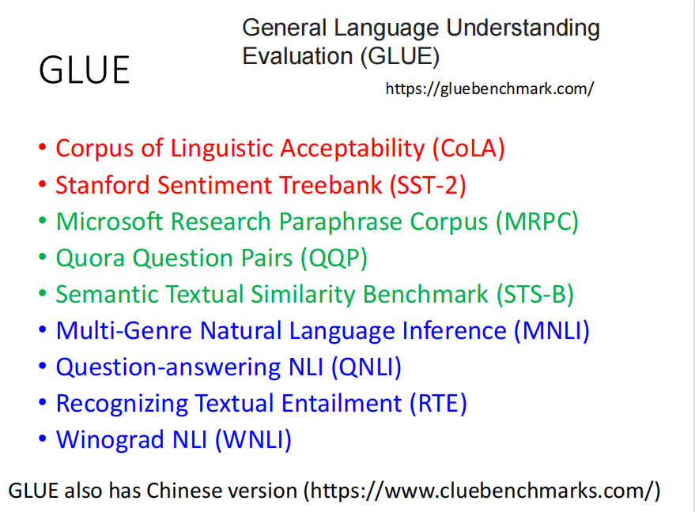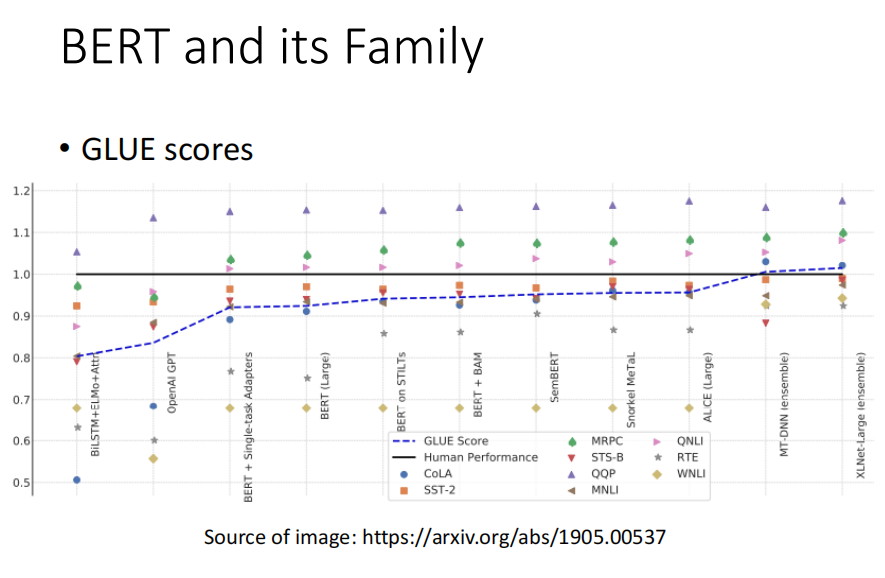

#### 4）BERT的例子

下面是BERT的四个简单例子。

Case1：输入一个句子，输出这个句子的结果是正向的还是负向的。

Case2：输入一个句子，输出这个句子每一部分对应的词性。

Case3：输入两个句子，输出这两个句子分类的结果(可能是这两个句子是否为同一类、或者这两个句子所描述的是否为同一个问题)。

Case4：输入一个问题(Q)和原文(D)，根据两个随机的向量，最终判断出回答(A)的开始位置s和停止位置e（s和e是两个整数）。

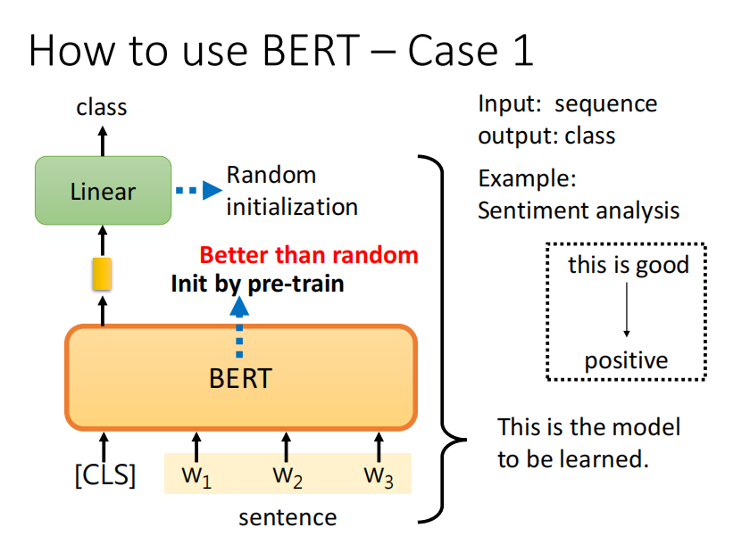

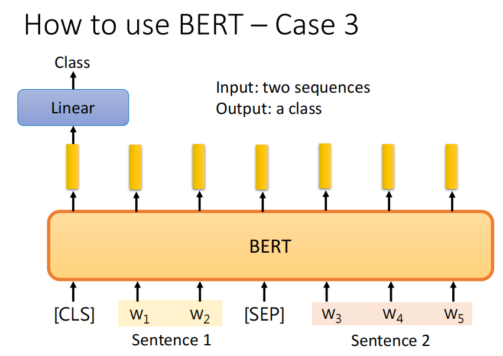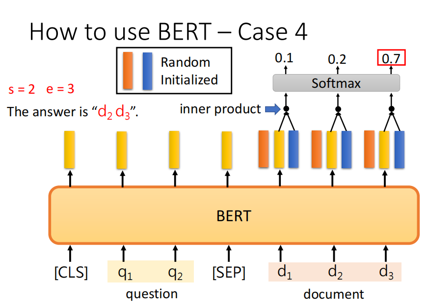

注意：CLS就是classification的意思，可以理解为用于下游的分类任务。

主要用于以下两种任务：

* 单文本分类任务：对于文本分类任务，BERT模型在文本前插入一个[CLS]符号，并将该符号对应的输出向量作为整篇文本的语义表示，用于文本分类，如下图所示。可以理解为：与文本中已有的其它字/词相比，这个无明显语义信息的符号会更“公平”地融合文本中各个字/词的语义信息。
* 语句对分类任务：该任务的实际应用场景包括：问答（判断一个问题与一个答案是否匹配）、语句匹配（两句话是否表达同一个意思）等。对于该任务，BERT模型除了添加[CLS]符号并将对应的输出作为文本的语义表示，还对输入的两句话用一个[SEP]符号作分割，并分别对两句话附加两个不同的文本向量以作区分。

我们在经过BERT之后，继续进行fine-tune操作时，`使用的参数初始值就是做填空问题的时候的参数值`，如下图所示使用填空问题得出的参数而不使用随机的初始化值我们的Loss下降的更快也更好。

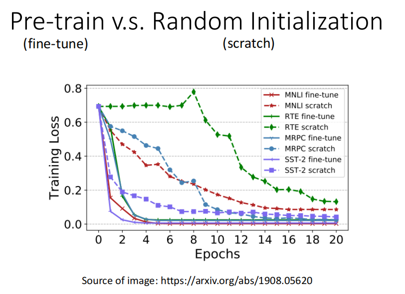

#### 5）BERT的有效性

研究发现一些比较相似的词在分布中也比较接近，而不相似的词分布比较远，比如下图的吃苹果和苹果电脑分布就比较远。

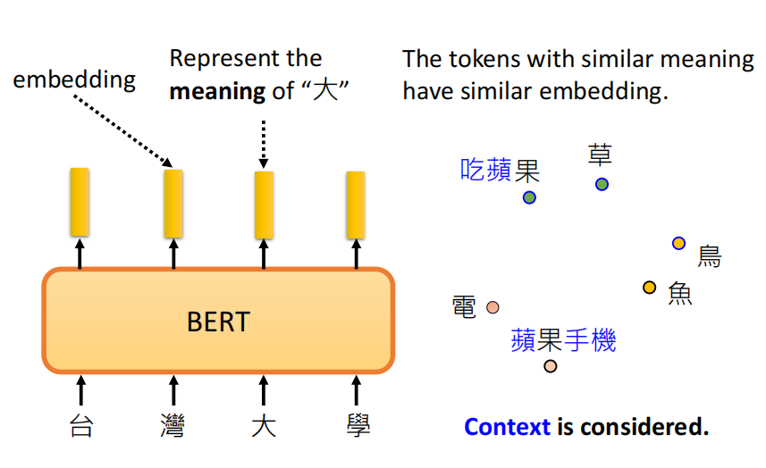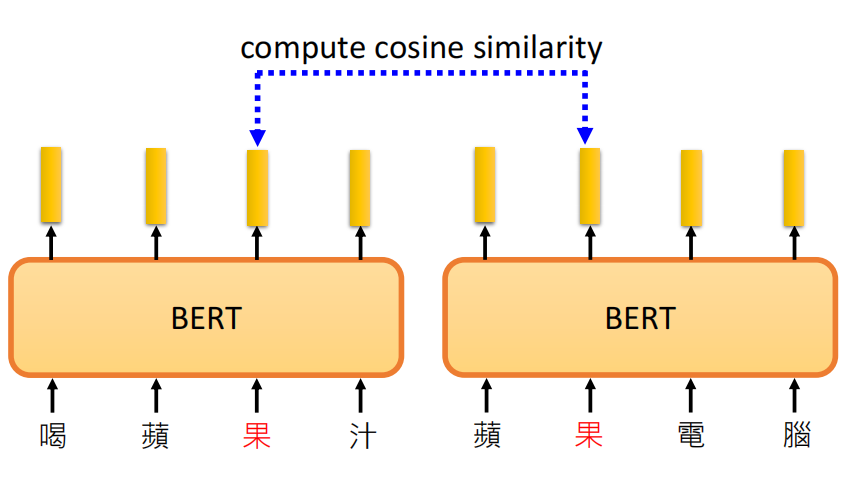

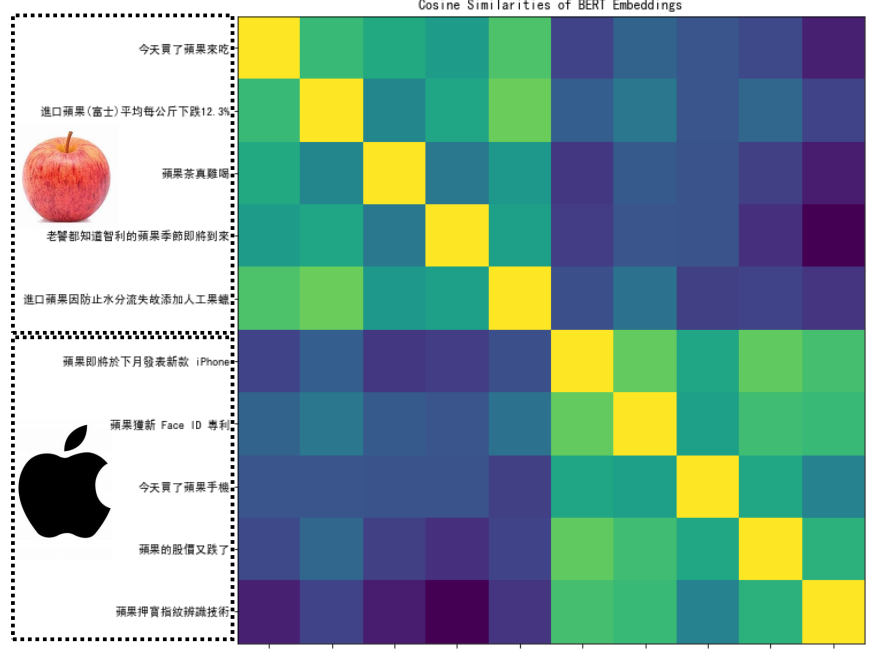

最终的训练结果我们可以看到上面的部分分布距离较近，下面的部分分布较近，但是两类之间分布较远。

将BERT应用在词的嵌入中，我们可以考虑上下文最终得出空缺的地方应该填什么词，右边是旧的词嵌入的方法。

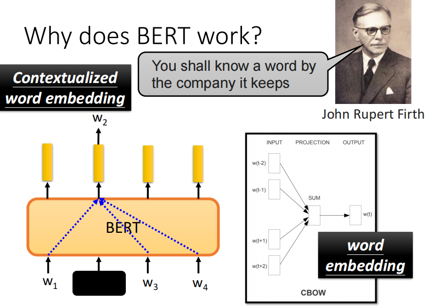

下面的三张图阐释了我们把BERT用在蛋白质，DNA序列，音乐的分类问题上，假设我们把所要评判的指标用不同的词表示，比如第二个图中将DNA的各个脱氧核糖核酸用不同的单词表示来做预测，最终如图三我们发现使用了BERT之后的效果反而是最好的。

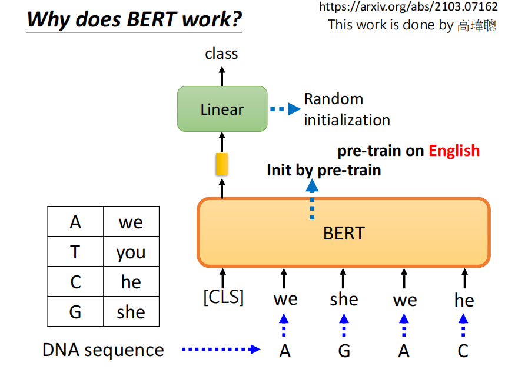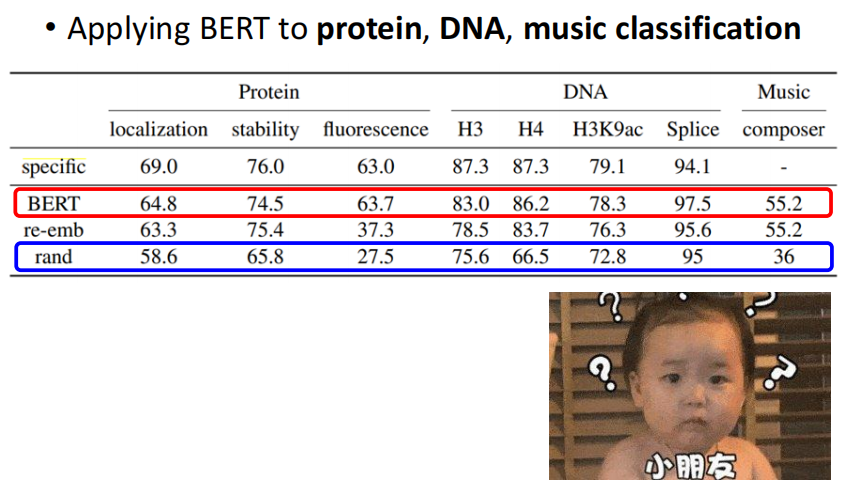、

多语言的BERT翻译问题，我们发现不光是输入英语的讯号转换成英文讯号使用BERT的效果优于QANet，甚至输入英文讯号，输出中文讯号的BERT的效果也是非常好的。

下图所示的分别是QANet的训练结果和BERT分别使用汉语和104种语言训练BERT做Pre-train的之后的结果。

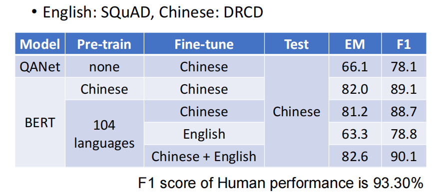

还有一种奇怪的现象是，英语和汉语在表示相近似的意思的时候也具有相近似的分布。

所以我们就可以使用BERT实现汉语和英语的转换。

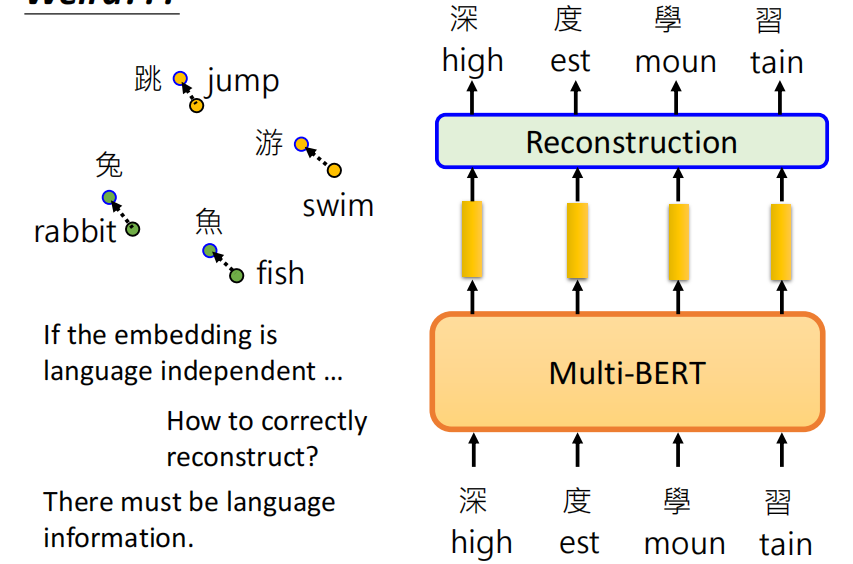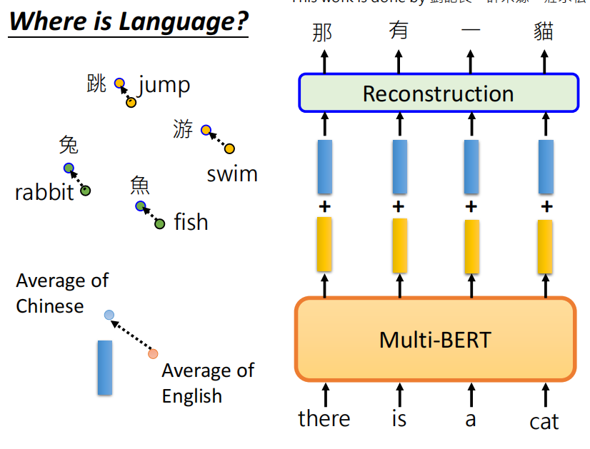

### 3.MASS/BART

***

人们对于填空问题中的对单词的屏蔽方式做了各种各样的调整，如下图所示，有的交换位置，有的删除一部分，最终所有这些统称为`BART`。

### 4.GPT

***

`GPT与BERT一样都是含有较大的参数量的结构，也都可以作为Seq2seq的Encoder`。

而GPT可以解决的是我们在一句话中**由前一输出结果预测接下来的输出结果**的功能，比如对“台湾大学”做训练之后，我们在测试的时候输入“台”，机器就会告诉我们下一个应该是输出“湾”，然后是“大”，最后是“学”。

(用独角兽来表示GPT的原因是GPT通过自己预测下一步的形式写出来了一则独角兽的假新闻。)

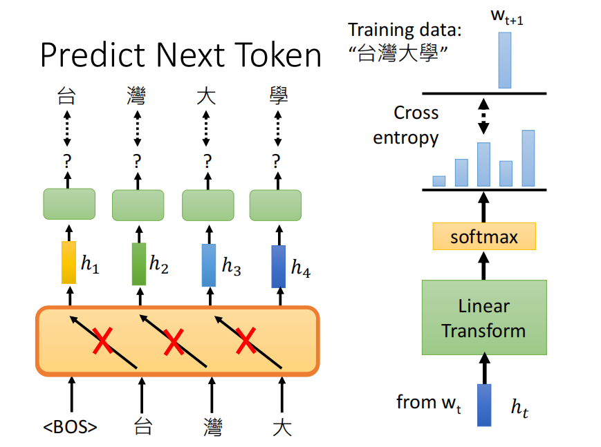

https://talktotransformer.com/z这个网站上可以自己写一小部分内容，他会自动写剩下的部分。

例如，我实验的结果如下图所示。

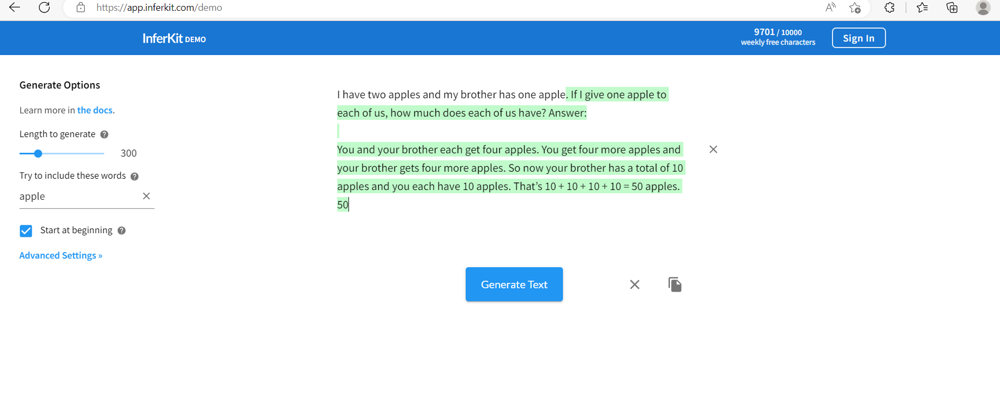

使用GPT我们可以完成一些简单的填空题，如下图左边所示。

下图右边是人们的一些使用GPT的想法，最上面是使用若干英语和法语的对应示例，去预测一个英语的法语应该是什么，到下面的只给出一个英语和法语的对应示例去预测，再到最下面不给任何的英语和法语的对应示例纯靠机器去预测。

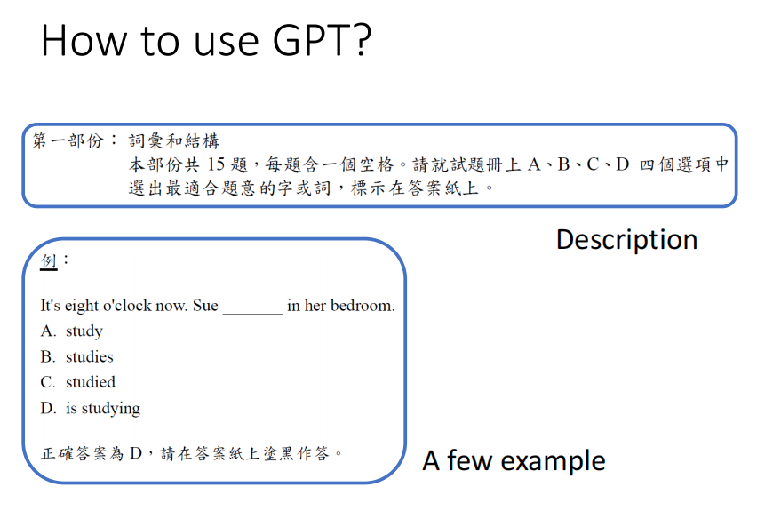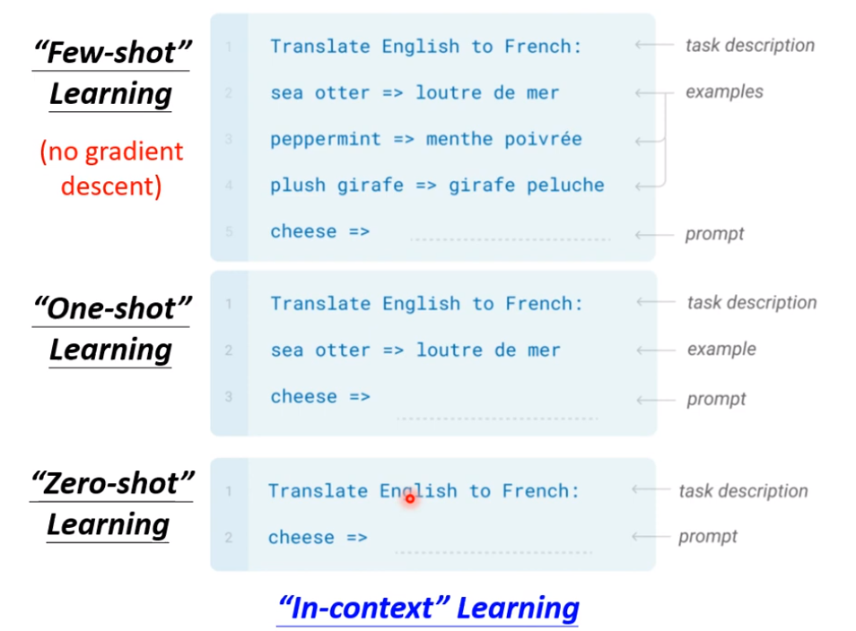

预测的准确率如下图所示。

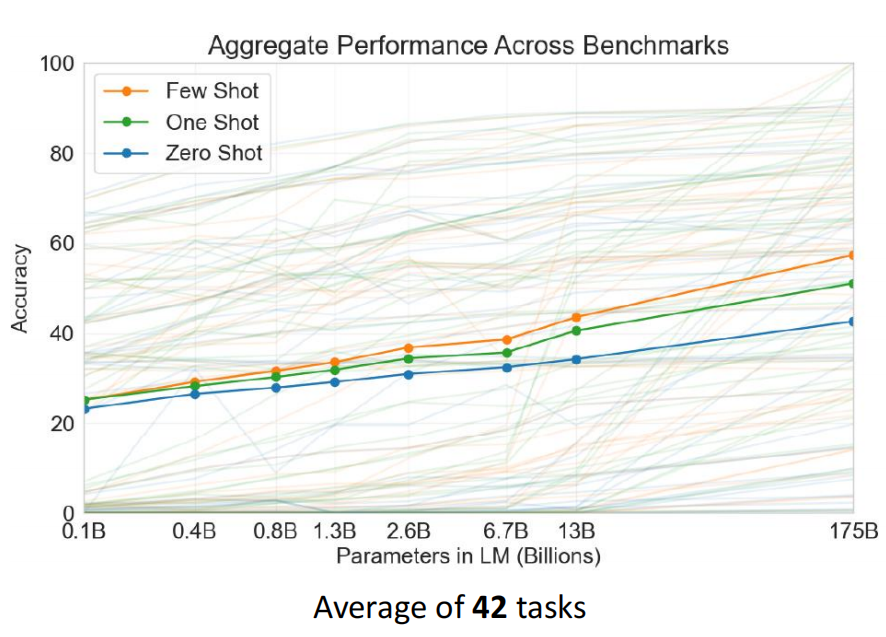

