# 2021李宏毅机器学习课程

## 第六部分、自编码器(Auto-encoder) 

### 1.Auto-encoder

***

Self-supervised learning是类似无监督学习的一种，self-supervised learning又叫做Pre-train。

`Auto-encoder`也可以用于图像辨识或者文字辨识问题，如右图所示是一个图像辨识问题。例如，我们输入一张`高维的图片`经过一个`Encoder`输出一个`低维的向量`，再用低维的向量作为输入，经过`Decoder`去`还原一张图片`，最终使得还原出来的图片和原图片尽可能的`接近`。

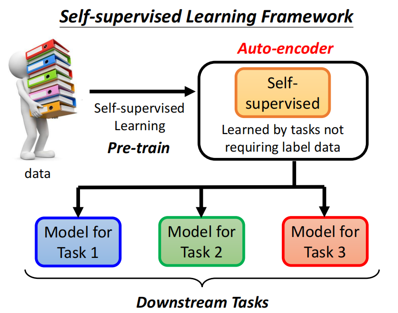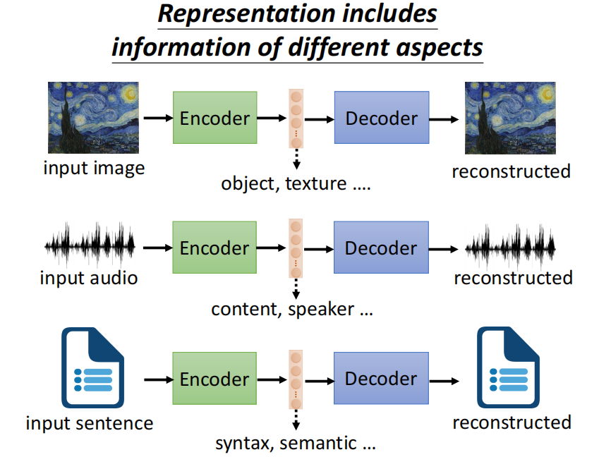

为什么一个高维的图片可以变成一个低维的向量，最后还能还原出一张图片？

因为一张图片看似是3 x 3的但是其中所蕴含的`变化是有限的`，比如下图所示的我们可以用一些二维的向量来表示3 x 3的图片的变化，从而实现用低维的向量表示一张图片，最后还能根据二维向量所对应的变化还原出图片。

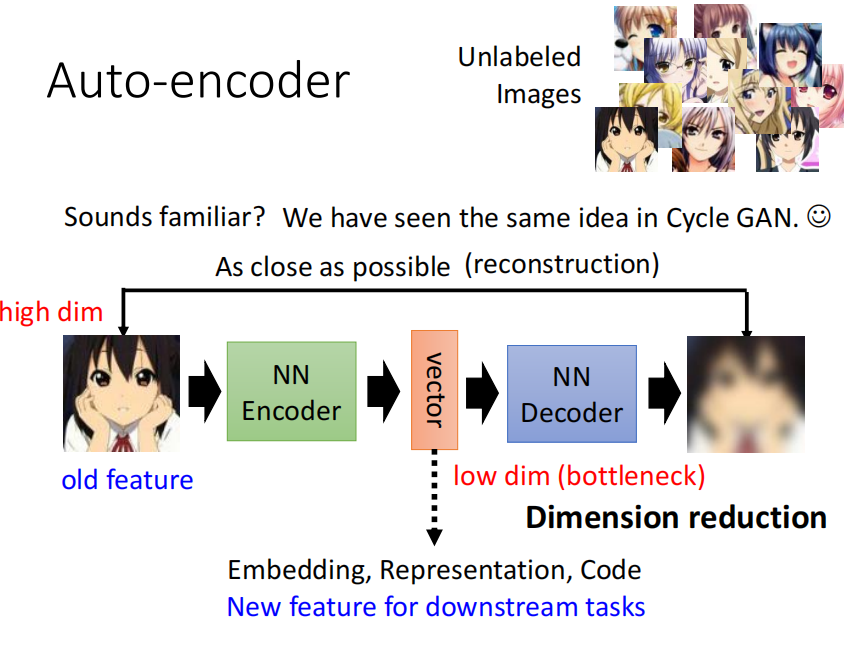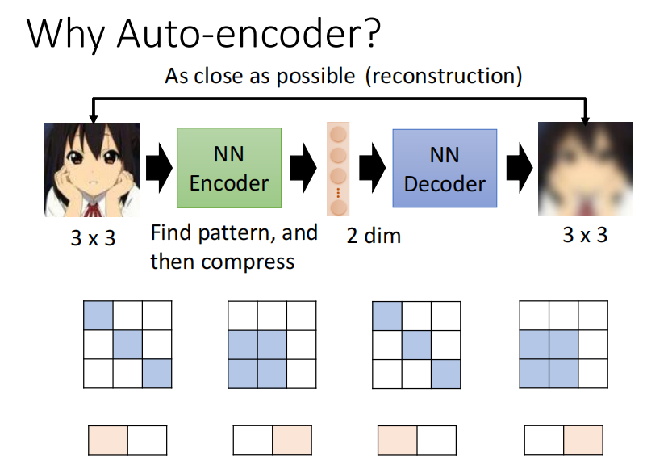

### 2.De-noising Auto-encoder

***

`De-noising Auto-encoder`指的是在对图片进行encoder之前，添加一些杂讯(noises)在图片中，然后经过变换还原图片，最后和原图片尽可能的接近。

De-noising Auto-encoder过程和BERT类似，都是在最开始添加了杂讯，然后进行处理的过程，其中各部分的所对应的名词如下图所示。

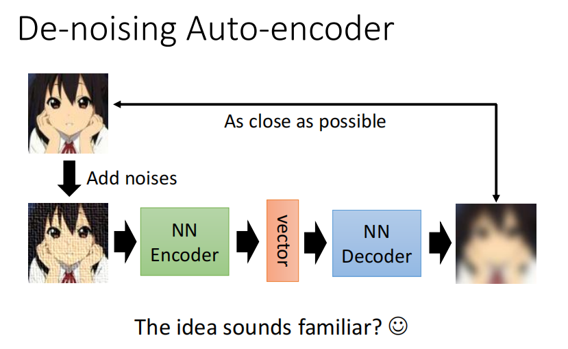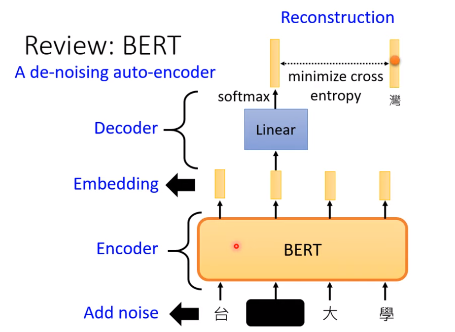

### 3.特征分离

***

我们还可以实现特征的分离(Feature Disentangle)，比如下图是输入一段音频，我们可通过一个Encoder使得音频的内容信息和说话者的音频信息(包括音高，语调等等)进行分离，还可以实现变声器的功能。

下图中间是简单的Auto-encoder过程，输入一段音频再还原。右图是语音特征分离再组合，实现变声器。

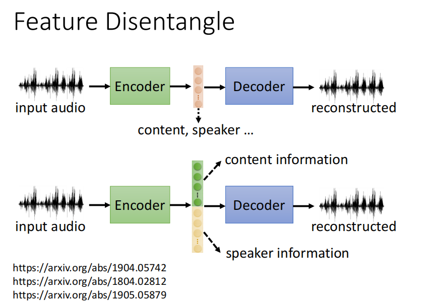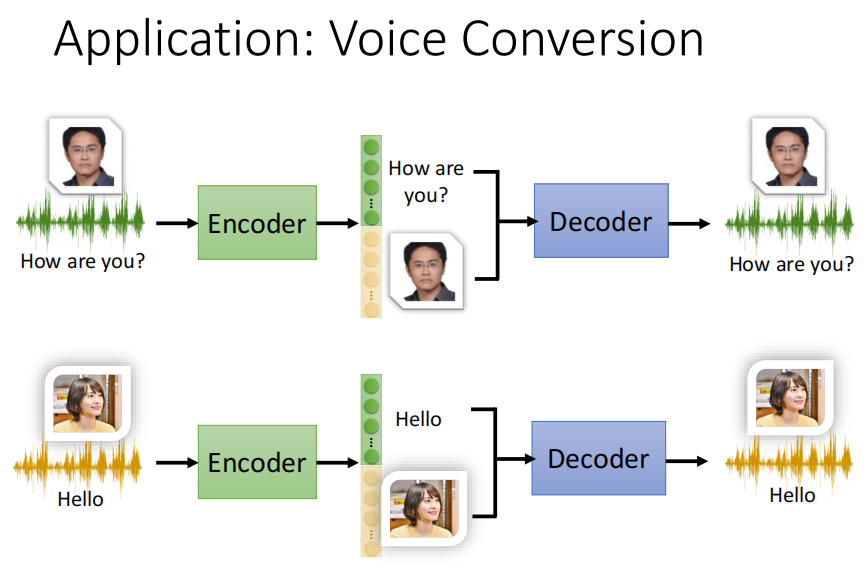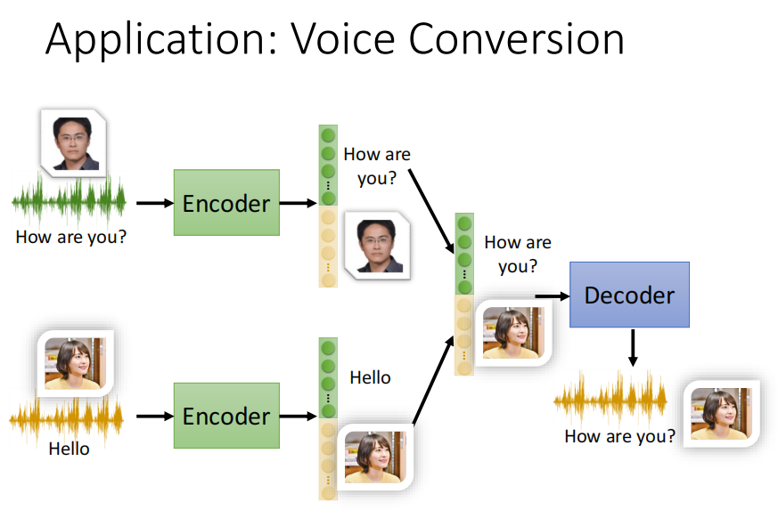

我们在特征分离的时候，中间的低维向量可以使用真实的数字、二进制、one-hot编码等来表示不同的特征。

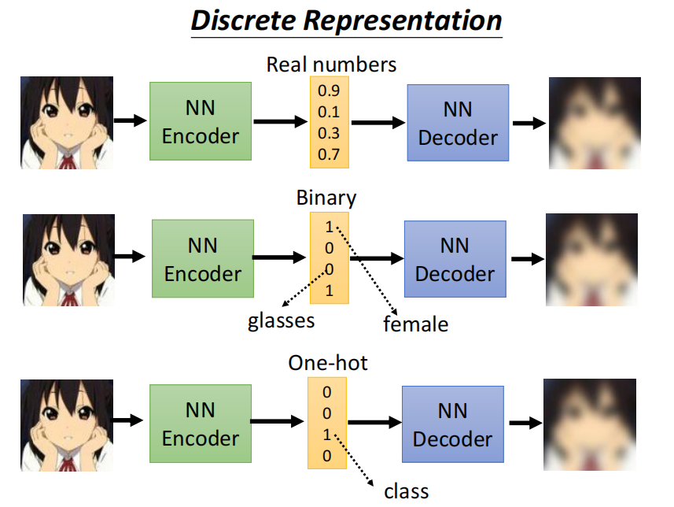

### 3.Vector Quantized Variational Auto-encoder (VQVAE)

***

下图表示的`矢量量化变分自动编码器（VQVAE）`指的是我们例如输入的图片通过Encoder之后得到一个低维向量，然后这个向量和我们数据集中学习得到的一些其他的向量`分析相关性(self-attention)`，最后拿最相关的作为输出，输入到Decoder中去还原图片。

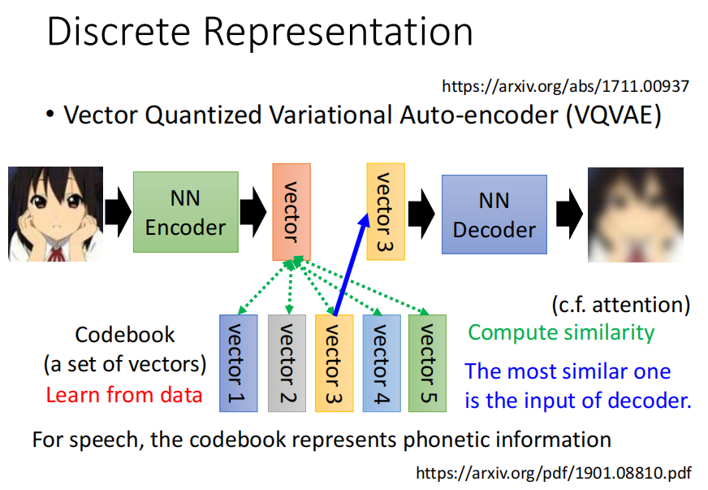

### 4.更多应用

***

#### 1）通过添加Discriminator输出文章摘要

下图所示的是机器通过训练大量文章，能够在encoder和decoder中间产生某种`暗号`，使得decoder能够还原出原文章，但是这个暗号是人们看不懂的，也就是中间的部分不能作为我们的摘要。

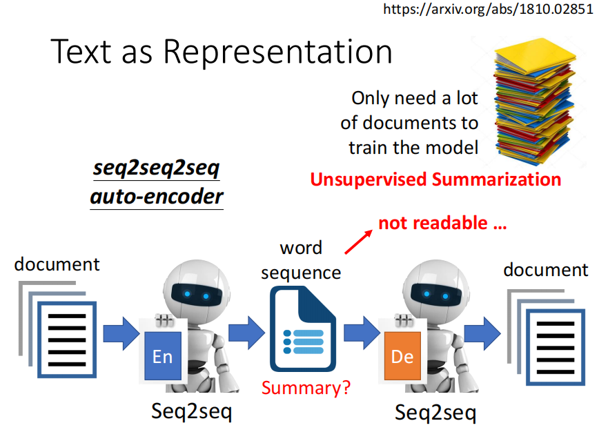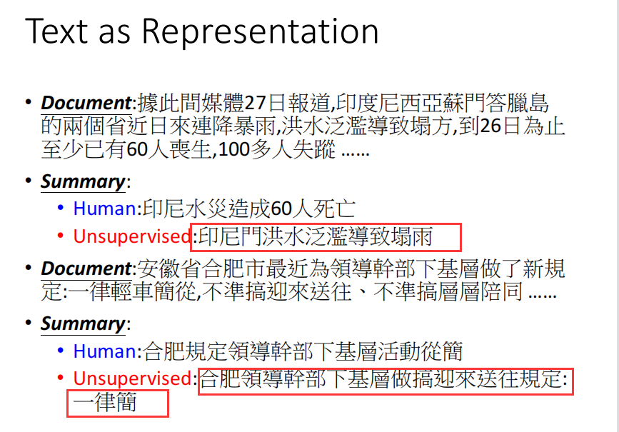

我们可以使用`GAN`中的想法添加一个看过人们写的文章的`Discriminator`，使得输出的摘要是我们能看懂的样子。

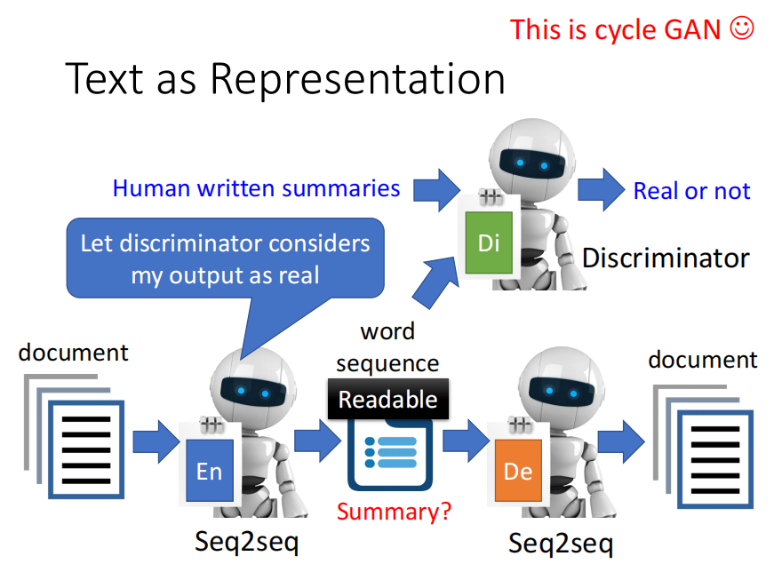

#### 2）Generator

我们发现Auto-encoder的后半部分和GAN中的，由一个向量输出一个图片是一致的，所以这部分就可以当作是`generator`来用，`VAE(variational auto-encoder)`就是这种思想设计的，将auto-encoder的decoder作为generator来用。

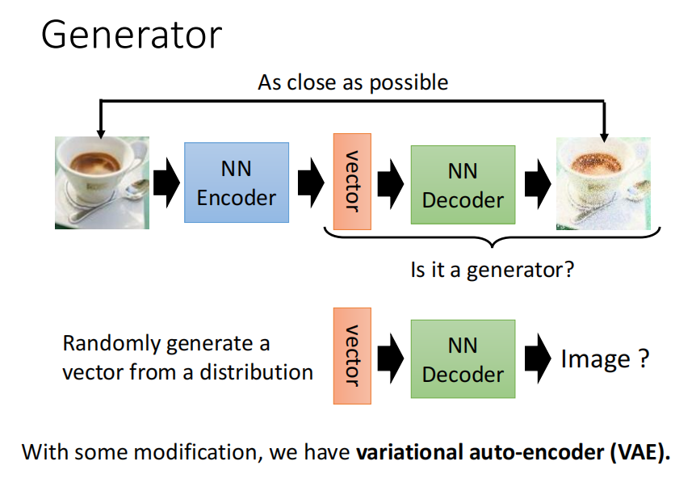

#### 3）Compression(压缩)

因为encoder就是输出一个低维的向量所以可以用作`压缩(Compression)`，反之decoder可以用作`解压缩(Decompression)`，但是这个过程会`丢帧(Lossy)`。

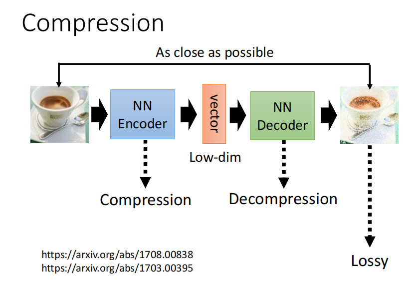

#### 4）Anomaly Detection(异常检测)

当一个新的资料来的时候，我们去判断他和我们训练的资料是否是`相似`的，是就输出`正常(normal)`，不是就输出`异常(anomaly)`。

相似的定义是根据情景来设计的。

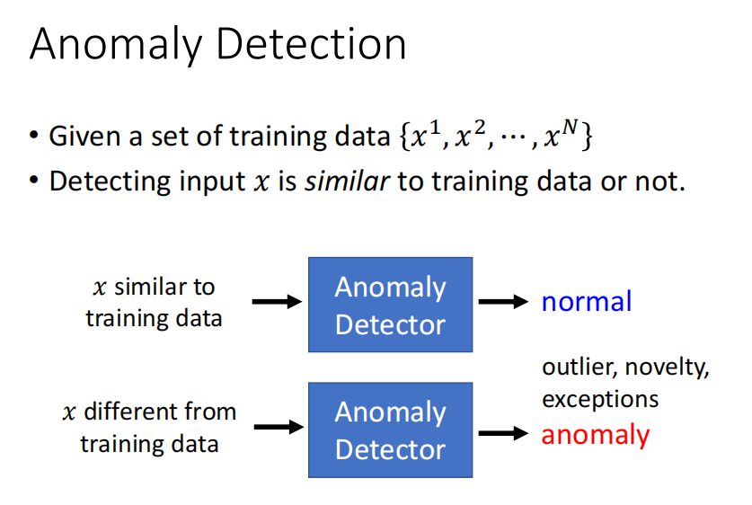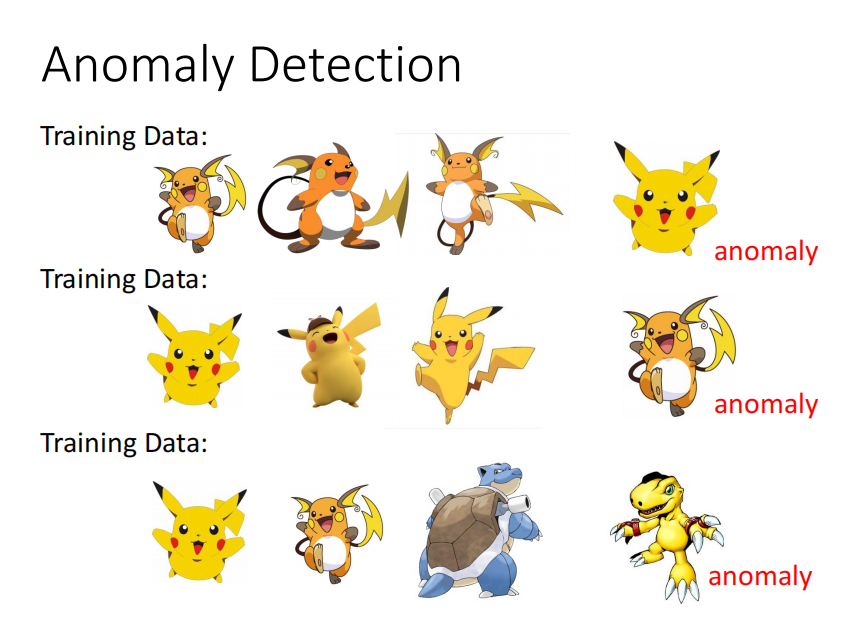

#### 5）制作图片

对于训练集训练过的人脸，我们就可以在测试集的时候`重建`出相似度很高的图片，而对于训练集没见过的图片，我们就不好完成图片的重建。

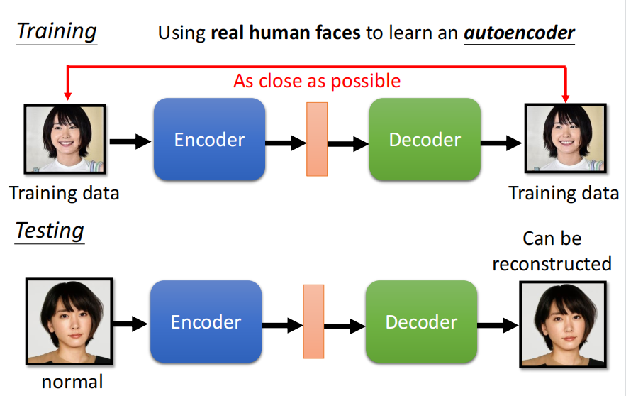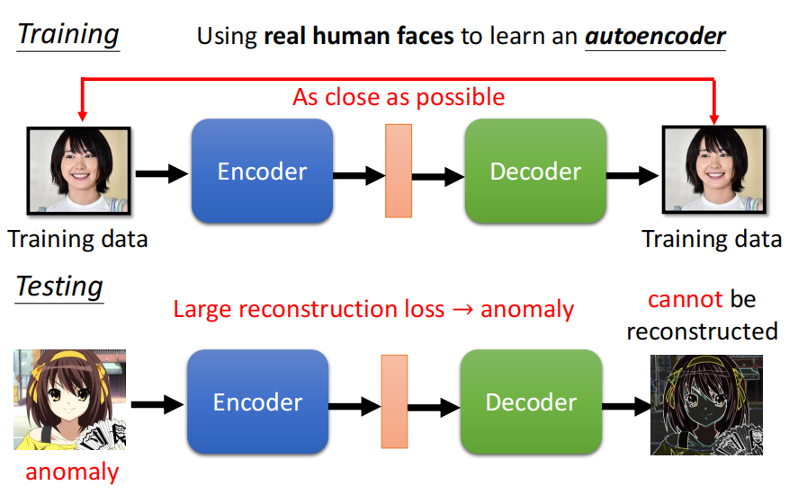

