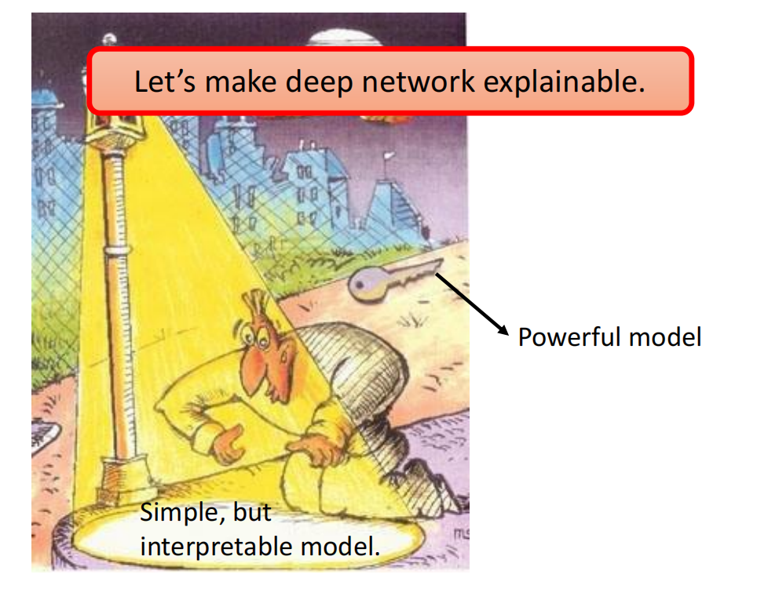
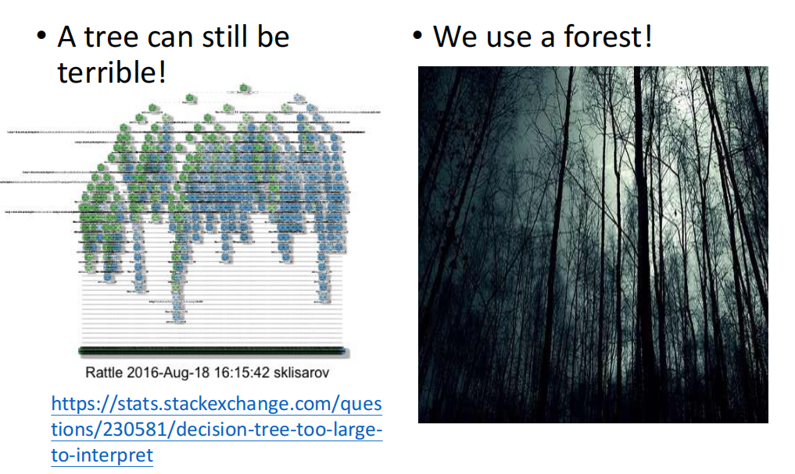

# 2021李宏毅机器学习课程

## 第七部分、可解释性的机器学习(Explainable ML)

### 1.Explainable ML

***

之前我们已经研究了如何从一张图片输出一个结果，并且学习了相关的模型，比如self-attention、self-supervised learning等等。那么这些模型输出结果的`理由`就是Explainable ML所要研究的问题。

例如，医疗问题中我们怎么知道这个机器学习得出的方案是合理的呢，而不是让机器学习是一个`黑箱`。

#### 1）可解释性与性能

我们都知道linear model就是做矩阵的乘法(线性变换)，所以linear的model具有很好的可解释性，而deep learning的model通常都是很深的多层复杂结构，对人们来说相当于是黑箱的，所以deep learning的model可解释性就很差。

但是，deep learning model的性能比linear model更加强大，那么我们如何衡量可解释性与性能呢？

右图是一个直观的例子，一个人的钥匙丢了，但是他只在路灯下寻找，理由是路灯下有光。

#### 2）decision tree

我们知道使用决策树的时候，每一步是为什么来到我们都可以知道，那么能否用decision tree来解决可解释性的问题？

答案是没那么简单，因为有时我们单单使用一个decision tree来解决问题这个决策树会很复杂，我们会使用很多个decision tree(forest)，所以决策树并不能很好的解决可解释性的问题。

#### 3）Explainable ML的目标

好的explanation就是人能接受，让人高兴的解释。

Explainable ML有两大类，一类是根据classification的结果进行解释(`local explanation`)，另一种是在我们还没有得出classification的结果的时候进行的解释(`global explanation`)，这两个也就是`Explanation AI`的两个关键的技术。

### 2.Local Explanation

***

即，分类的`组成部分(component)`中哪些部分是得出分类结果的关键部分。

例如，右图表示的就是用灰色的方块去覆盖图片，红色的部分表示方块放在该位置时分类结果正确的情况，蓝色时分类错误的情况，我们就可以发现分类时小狗主要是依据小狗脸的部分，分类轮胎主要就是依据轮胎的部分。

如何判断某个component是重要的，我们可以给他加上一个`∆x`，得出一个`∆e`，最后如果∆e趋近于0，那么这个特征x是不重要的，重要性就用`∆e/∆x`来表示，最后其`微分(梯度)`的计算结果画的图就是`Saliency Map`，其中白色的就是比值比较大的，黑色就是比值比较小的。

但是这种求梯度表示特征重要性的方法也会有一些`局限性`，比如下面两张图。

左图是当我们识别瞪羚的时候其周围也有一些白色的点，使得我们的观感不是很好，可以使用`SmoothGrad`的方法添加一些杂讯的方式输出一些结果最后平均所有结果再得出Saliency Map，可以看出观感就变好了。

右图是对于大象的鼻子长度求梯度的时候，由于大象鼻子长度从短到长我们可以认为他是一个大象，但是当象鼻子超过某一个界限无限变长的时候，我们的偏导数会逐渐趋近于0，最终我们可能会判断说象鼻子不是一个判断大象的重要的特征，解决这种问题的方法是`IG`。

### 3.Global Explanation

***

与local explanation不同的是，global explanation不是根据给出的分类的结果去解释为什么是这个类，而是在还没有分类结果的时候解释模型的哪些参数能够得出分类结果，即NetWork心里所期盼的这个类应该长什么样子。

如下图所示的一个CNN的架构，我们每一次经过一个filter之后，global explanation都期望能够通过自己输入一个不在data中的数据(X)，得到`尽可能符合filter结果特征`的矩阵，即
$$
X^* = argmax_x\sum_i \sum_j a_{ij}
$$

这时候使用的就不是gradient decent而是gradient ascent。

例如，左图是对于一个数字识别的问题，我们从左下角开始得到NetWork架构中所有的filter的结果，可以看到左下角可能是判断有没有竖线，后面是判断有没有横线，在后面是判断有没有斜线等等。

右图是对于最后的分类结果输出的矩阵，我们发现虽然最后他把一堆杂讯分类成了0-9的数字，但是这也是可以实现的。

在这里为了避免最后我们辛苦一场判断出来的机器的评判准则是杂讯的情况，我们加上了一个`R(X)`，这个R(X)就是添加了一些限制条件，比如下面左图是添加限制条件为去掉一些白色的点之后的结果，和数字就接近了一点。

右图是添加了更为复杂的限制之后，能够得到一些机器所认为的动物的图片。

所以我们就可以把问题从对于data没见过的数据X，寻找符合机器想法的结果，变成了寻找z，而且这个和GAN进行结合我们就可以对这个低维的向量z通过一个Generator过程得到一个图片X，我们把这个图片X作为输入放入NetWork架构中进行而分类。

这就是Explanation AI的一种思想，也就是让机器自己得到自己认为的图片应该是什么样子。

### 4.解释网络架构的Input部分

***

对于解释一个NetWork的输入数据部分是怎么样的，我们有两种方式，一种是`人直接观察(Visualization)`，另一种是添加一些`探针(Probing)`。

首先是`直接观察`的部分，假设我们观察的输入通过不同的层之后会得到100维的数据，为了方便我们观察我们可以使用`PCA`或`t-SNE`的方式进行降维。

右图所示的两个分别是我们把一个语音通过降维之后的二维数据输出到图中，第一个是原始的输入，我们发现虽然不同的颜色表示不同的说话者吗，但是不同的人说相同的话的结果并没有很接近。而通过了8层网络结构之后，相同的话逐渐变成一条一条的线。

然后是添加`探针`的部分，例如我们对于一个BERT的架构，我们可以探测他某一步是否输出了词性，或者是否得到了一些地名等等。

右图中是一个输入一段声音讯号，然后通过一些层之后我们再收集结果，通过`TTS模型`去还原原来的音频，如果通过这些层的时候语者的资讯被删去了，那么还原的结果会听不出是男生还是女生的一种声音。

### 5.用linear model解释黑盒

***

因为黑盒我们是很难去解释的，但是我们知道linear的结构比较简单，所以我们如果可以用一个linear model去达成和黑盒相似的工作结果，那么我们就可以用linear model去解释黑盒内部的原理。

（这个很难实现，因为黑盒比linear model通常情况下复杂很多。）

