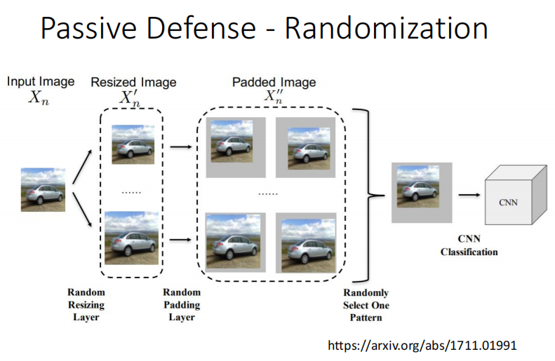

# 2021李宏毅机器学习课程

## 第八部分、对抗性攻击(Adversarial Attack)

### 1.Motivation动机

***

我们在实际生活中会遇到各种各样的攻击，比如垃圾邮件，或者奇怪的带有杂讯的输入导致不合适的输出。那么我们搭建的NetWork能否很好的抵御攻击就是这个领域讨论的问题。

### 2.如何攻击(Attack)

***

#### 1）Example of Attack

下面我们看一个简单的攻击网络的例子，我们使用一个网络去分类出了一个猫的图片，当我们添加一些人多肉眼看不出来的`杂讯`的时候，会得到一些奇怪的分类错误。

制造这些杂讯进行攻击很简单，首先如下图所示原始的图片是x0，x是我们添加了杂讯的新图片，我们期望的是有一个目标的预测结果ytarget，他和我们使用x的预测结果y要尽可能地`近`，而我们的预测结果y要和x0的正确的预测结果y^尽可能地`远`。

我们衡量远近用的都是`交叉熵损失函数(cross-entropy)`，然后在y和y^的损失值Loss上加负号，所以最终我们只需要使得x*越小越好。

除此之外每次还需要考虑一个`d(x0,x)≤ε`，这个是x0和x的距离要小于人类能够识别的范围，如果距离＞ε，那么人们就能看出来这个图片的杂讯。

#### 2）d(x0,x)≤ε

对于这个`d(x0,x)≤ε`有两种方式衡量，一种是`L2-norm`，另一种是`L-infinity`，我们把x和x0都用向量表示，差值平方求和就是L2-norm，选最大值就是L-infinity。

右图所示的就是两种对图片进行调整的方式，上面是每一个部分都加了一点小杂讯，下面是只在右下角绿色的部分加了较大的杂讯其他部分没变化。

最后L2-norm的两个结果是一样的，而L-infinity不同，对于上面那种我们人眼不容易辨认的杂讯，其L-infinity是较小的。所以我们通常使用L-infinity方式来表示d(x0,x)≤ε。

每次对x的调整类似于梯度下降，只不过我们每次更新的不是参数而是输出的图片向量，并且初始值不是随机的而是用x0作为初始值。上图是两种更新方式。

第一种，是左图所示的每次都梯度下降(`Gredient Descent`)更新，但是要确保d(x0,x)≤ε，一旦＞ε，那么就找x0上下左右范围ε内和x距离最近的点把x拉回来(`fixed`)。

注意这里x0关于ε的范围是正方形而不是圆形的原因是这个正方形表示的是x与x0横、纵坐标的差≤ε的意思。

第二种，是右图所示的只进行一次更新(`FGSM`)作为最终的x输入其中，这个方法类似碰运气，所以通常我们可能进行好几个一次更新，最终选取满足我们要求的，如果出现超出范围的也是找范围内最近的拉回来(`fixed`)。这种只更新一次的方式我们使用的不是梯度下降而是一种符号函数sign(t)，每次移动的都是ε +1 或者 -1，所以最终结果会在四个角上(相当横纵坐标±1)。

### 3.White Box v.s. Black Box

***

我们前面所讲的更新参数的方式都是`White Box`也就是我们都是知道参数是什么进行的更新。

`Black Box`反之就是我们不知道参数的NetWork架构，而且黑箱也是可以被攻击的，比如我们知道这个黑箱的训练资料是什么，我们在自己的网络架构中使用这个训练资料也得到了一个模型，那么我们对自己的网络架构进行攻击(给图片加杂讯)，由于我们的网络架构和黑箱的网络架构使用的是同一个训练资料，所以一定会有一定的相似度，最终用来攻击我们自己的网络架构的图片也可以成功的攻击黑箱的架构。

上面的最后一个图表示的是一些做白箱和黑箱攻击的测试结果，对角线是白箱攻击，其他未知都是黑箱攻击，表示的值是攻击后的准确率，我们发现白箱攻击后准确率都是0，黑箱攻击之后网络架构越接近能够使得正确率更低。而下面这个表格与上面相反，对角线是黑箱攻击(即，第一个位置应该用ResNet-152去攻击，但是他用了其他的NetWork)，而非对角线才是白箱攻击。

下图表示的就是为什么攻击这么容易成功的一个实验，我们发现输入一个小丑鱼的图片，对于各种模型，中间深蓝色的部分是预测为小丑鱼的时候，当我们用VGG-16进行训练的时候，竖向移动不会产生什么攻击但是横向移动会产生攻击，我们把这个产生了攻击的结果输入到其他模型中之后横向都会很容易被攻击到。这个原因**可能**并不是模型不够好，而是我们的训练资料本身的一些问题产生的，比如添加了一些杂讯之后他本身的问题导致了模型容易被攻击，如果我们的训练资料足够多的时候我们可能就可以避免被攻击。

下图所示的是两种攻击，第一个图是只修改一个像素就可以产生攻击，第二个图是不需要费力气去寻找一个可以产生攻击的像素而是用一个通用的杂讯贴到任何一个图片里都快可以产生攻击(这个还真的是存在的)。

### 4.除了图片之外的其他攻击

除了对图片进行攻击我们也可以对语音进行合成攻击，对文字进行攻击，以及在真实世界中的攻击，例如，带上一个神奇的眼镜可以骗过人脸识别系统（甚至是全方位去人脸识别都能骗过）。

下图所示的是与之前不同，不在testing上攻击，而是在`train`的时候就进行攻击，比如我们做图片的识别，我们对输入的某一张图片加入一些杂讯，然后正常去训练，其他图片都是正常的，最终在testing的时候如果遇到这个图片他就会`走后门`似的输出奇怪的结果。例如你在网上下载了某人公开的人脸识别的数据集，在自己的模型中训练之后效果非常好，但是实际上这个数据集中的某些照片是加了特殊杂讯的，当知道他的人使用人脸识别的时候就可能会输出和你的模型预期不一致的结果。（当然这种开后门的方式也是有各种各样的限制的）

### 5.防御（Defense）

#### 1）被动防御(Passive defense)

不需要动我们的模型，只是在前面加一个filter对图片进行一些处理挡住Attack，比如对图片进行`模糊化`(Smoothing)，`副作用`就是我们对于没有添加杂讯的图片使用了Smoothing模糊化之后，可能会让原来正确的结果预测错误。

进行`压缩`和`解压缩`，由于压缩会丢帧，所以也可能会达到预防攻击的作用。或者对输入的图片经过`Generator`进行再次生成一遍，也可以预防攻击。

不过如果**被攻击者知道防御者使用了模糊化技术**，攻击者就可以在自己的模型的第一层放一个模糊化，在自己的模型中就考虑到这个问题，从而完成在其他使用了模糊化模型上的攻击。

所以更厉害的是`随机化`防御，如下图所示，我们自己也不知道他图片输入进来会进行那种随机的防御。（也可能会被攻破）

#### 2）主动防御(Proactive Defense)

`Adversarial Training`主动防御就是我们在训练的时候就主动加入各种杂讯对模型进行攻击，遇到错误我们也可以主动对结果进行修正，当测试的时候真的遇到攻击产生了错误，我们也可以根据训练中遇到过的情况把结果拉回来。

这种方式就算不是考虑模型被攻击，单纯使用也可以对`数据增强`，使得自己的模型训练的更好，更`不容易过拟合`。

存在的问题一个是对于训练的时候没有预见过的问题，也挡不住新的攻击。另一个是我们会需要很大的运算资源。

