# 2021李宏毅机器学习课程

## 第九部分、领域自适应(Domain Adaptation)

### 1.Domain Shift

***

`Domain Shift`是指的训练集和测试集的差异。

如下面左图所示，也许我们做一个数字识别的例子，在训练集上已经有了一个比较好的结果，但是当测试集的数据`分布`发生变化的时候可能识别效果就会大打折扣。

如图右所示，是三种Domain Shift的可能情况。

1. 训练集和测试集的`分布`不同。
2. 训练集和测试集的`产生结果`可能不同，例如左边是各个数字的识别概率是相同的，右边是概率不同。
3. 对于同一个数字在训练集和测试集上的`标注(y)`是不一样的。

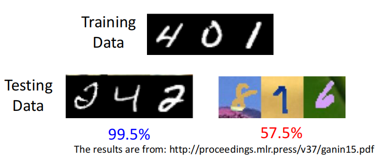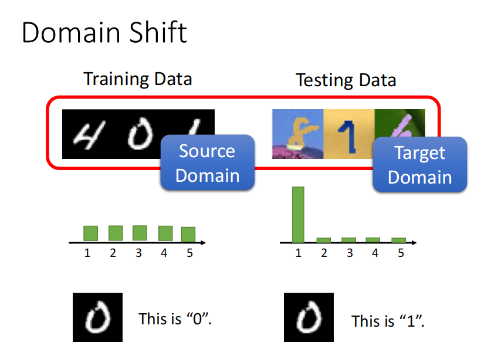

### 2.Domain Adaptation

***

#### 1）测试集数据带有类别标记

对于分布不同的训练集和测试集，当测试集自带`类别标记(y)`时，我们只需要在训练集的现有模型上加一些微调，再跑几个epoch我们可能就会得到符合要求的结果。但是由于这种带有标记的分布不同的测试集数量是非常少的，所以我们训练的时候要注意不要训练的太过了，导致在测试集上发生`过拟合(Overfitting)`。

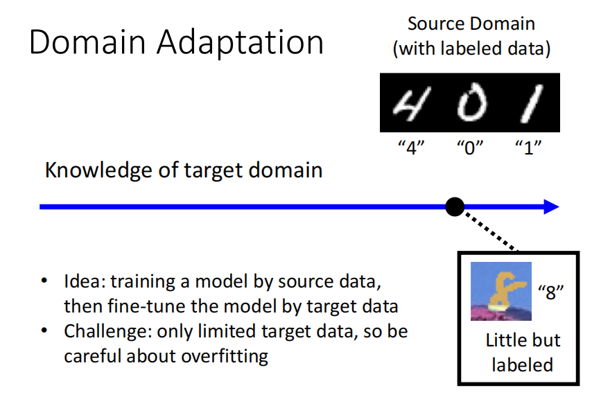

#### 2）测试集数据不带有类别标记

当我们的测试集中的分布和训练集不同，并且训练集`没有带类别标记(y)`的时候，如下图左所示。

基本的解决方法如右图所示，我们可以找一个`Feature Extractor`的网络架构，功能是将训练集和测试集上的例如颜色的资讯滤掉，使得原来分布不同的训练集和测试集，变成相同分布的数据。

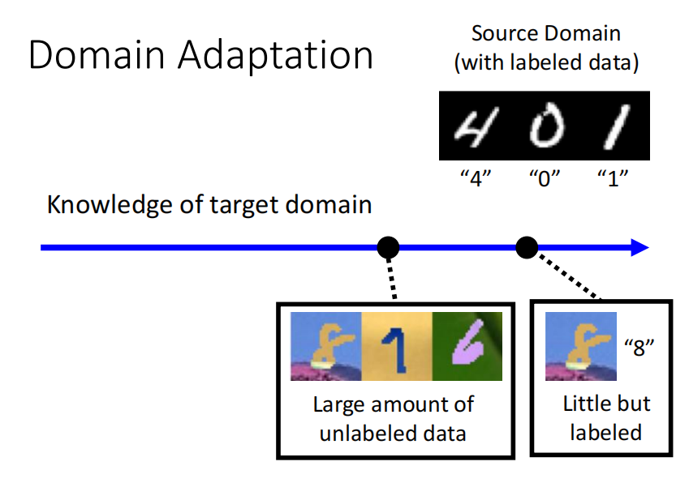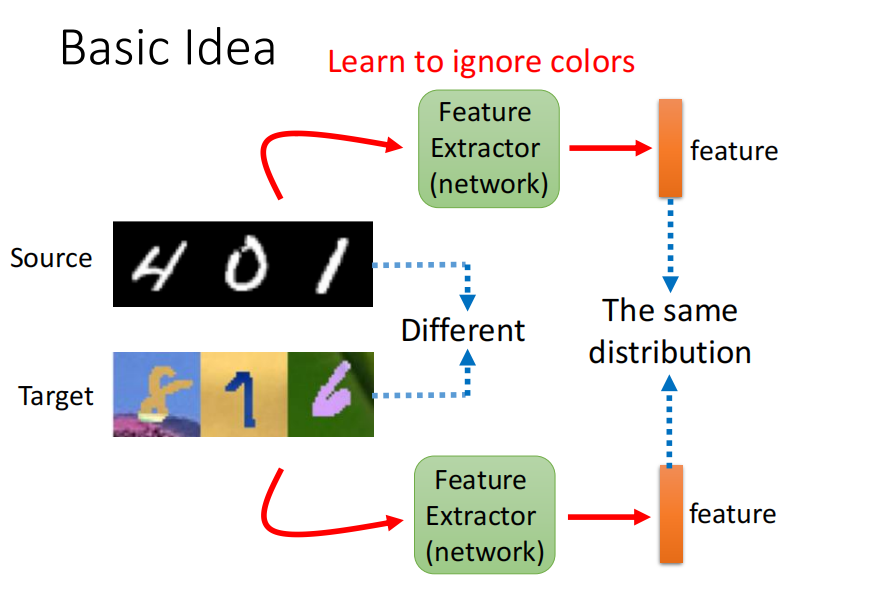

### 3.Domain Adversarial Training

***

#### 1）Feature Extractor and Domain Classifier

`Domain Adversarial Training领域对抗性训练`指的就是，在我们做分类任务的网络架构中，前几层可能是一个`Feature Extractor`用来滤掉差异的分布，将滤掉不同分布后的相同分布的结果，由于Feature Extractor使用的是`CNN`所以得到一个`Feature Map`，后面再拉直，放入`Label Predictor`中做类别分类。

`Domain Classifier`是用于将Feature Extractor之后的结果(Feature Map)通过分类得出是训练集的输入还是测试集的输入，很类似`GAN`网络的结构，Feature Extractor类似于`Generator`，Domain Classifier类似于`Discriminator`因为他看过训练集和测试集的数据。

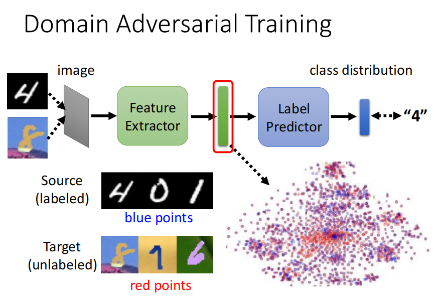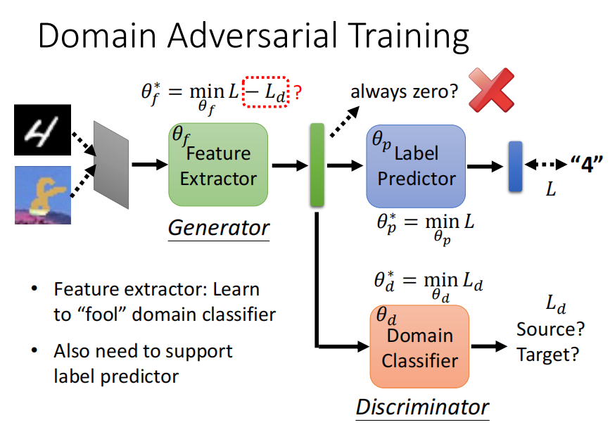

#### 2）Decision Boundary

`Decision Boundary指的是判别边界`,如下图左所示，对于两种分类，我们认为右边的有清晰的判别边界的情况是好的情况。用图右的形式表示出来就是对于没有类别标记的数据，我们希望最终的输出结果尽可能集中在某一个类别上，而不要是每个类别都有可能。

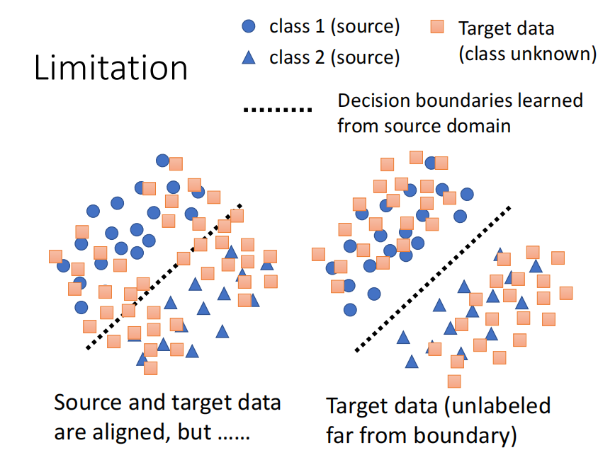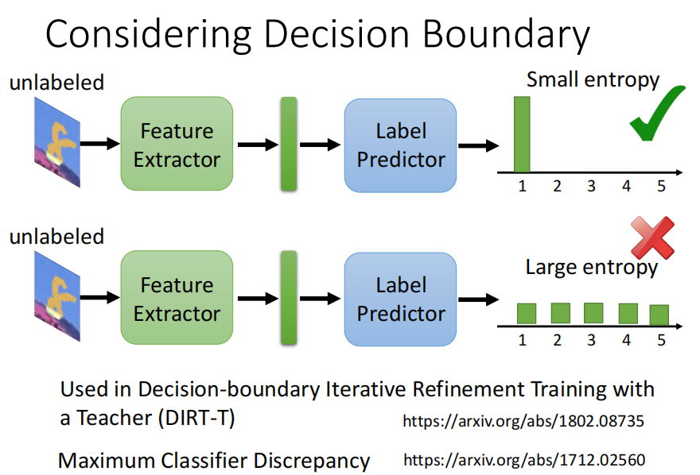

当训练集和测试集的类别不一致的时候如何应对，文章`Universal domain adaptation`给了我们解释。

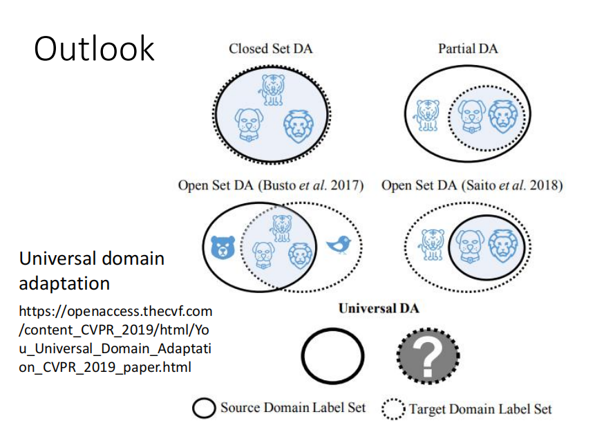

### 4.其他的测试集情况

#### 1）测试集非常少，并且没有类别标记

当测试集没有类别标记(y)的同时，数量还非常少的时候，我们可以使用`Testing Time Training(TTT)`的方式进行处理。

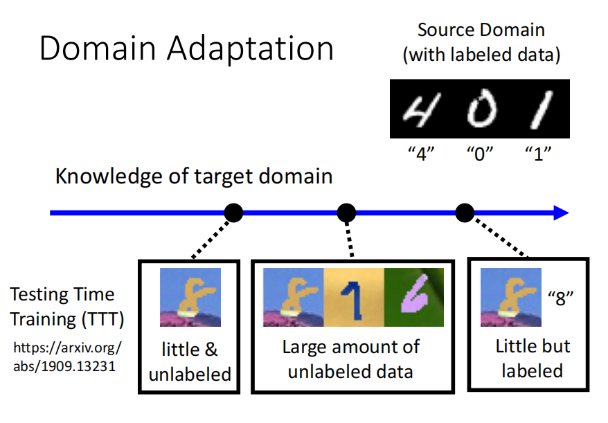

#### 2）对测试集一无所知

当我们对于测试集一无所知的情况，又分为两种。

第一种，是图右所示的`训练集非常丰富`，测试之后效果比较好。

第二种，是图右所示的`训练集训练种类比较少`，测试集非常丰富，这种就需要我们在训练的时候使用一些`数据增强(data augmentation)`的技术，使得训练集尽可能的丰富。

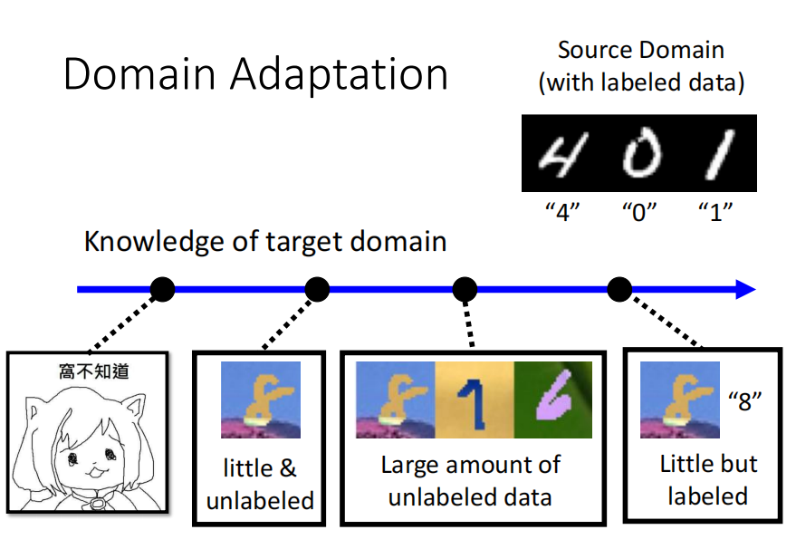