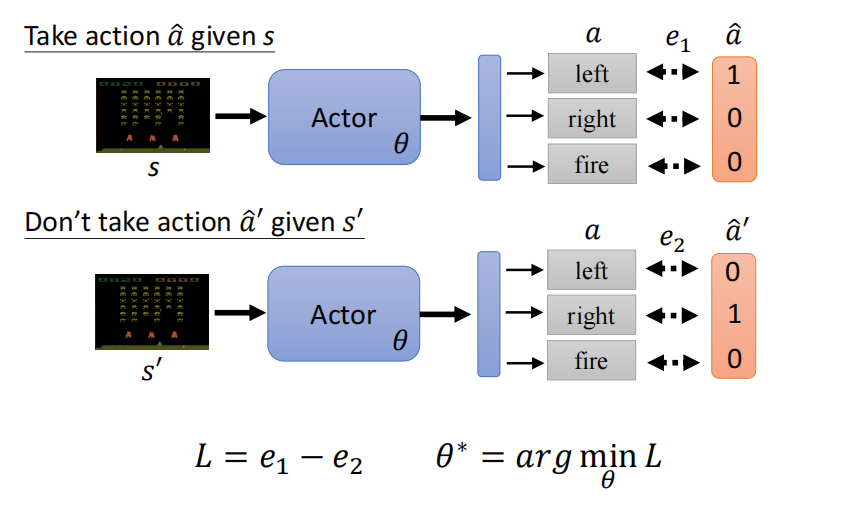

# 2021李宏毅机器学习课程

## 第十部分、 强化学习Reinforcement Learning (RL)

### 1.Reinforcement Learning

***

强化学习(RL)也是有监督学习的一种，前面提到的sulf-supervised learning和Auto-encoder虽然说是无监督学习但一种，但是处理思想其实也是有监督，只不过类别标签不需要人标出，由机器自己就可以产生。

和机器学习一样，强化学习的过程也是输入一个环境的`信息(Observation)`输出一个对应的`行为(Action)`，并且都每次把行为作用在环境之后会得到一个`回报(Reward)`。

经典的例子就是下围棋的AlphaGo。

回顾机器学习第三步，第一步是寻找一个有未知数的function，第二部是定义损失函数，第三步是定义优化器去更新参数。

#### 1）RL基本步骤

强化学习的步骤也是和机器学习一样的三步组成的。

例如，下图是一个用RL做的打游戏的例子，第一步定义函数就是定义RL的Actor，这个部分包含了各种的未知的参数等待我们去学习。

第二步，定义Loss，在RL中从开始执行各种动作到游戏结束称为一个`episode`，每一步所有的reward加起来就是Total reward也叫return（R）。这个R就是我们的训练目标，我们希望他越大越好，所以我们可以拿-R作为我们的Loss。

注意：**reward**指的是每次action后的即时回报，而**return**是所有reward的总和。而且每次得到reward不仅仅是由action决定，也和前一个状态的环境有关。

第三步，定义优化器optimization，由于每次的行为和环境**互动**的结果都是随机的，而reward和environment对我们来说都相当于是`黑箱`并且可能也有`随机性`，所以如何设计优化器是一个强化学习的**关键问题**。

**RL的随机性**指的是在testing的时候，当我们使用同样的actor输入，最终的输出是不一样的。而我们在train模型的时候固定的`random seed`目的是让模型训练的初始化参数是一致的。

回想在GAN中学的部分我们通过将`generator`和`discriminator`连接起来，调节generator的参数期望discriminator的输出越大越好。

同理RL中我们也是将`actor`和`reward + environment`连接起来，通过调节actor使得reward+environment的输出越大越好。

而GAN和RL不同的是discriminator是一个**network**，我们也可以通过调整参数的方式进行优化，而RL中的reward+environment不是network无法去优化。

#### 2）控制Actor输出的行为

假设我们想要让一看到S图片就选择a^的行为，即向左走，可以通过我们Actor得出的行为的结果和向左走的正确情况结果做对比，计算两个的`交叉熵(cross-entropy)`，得到一个损失值e，让e越小，我们的行为就越接近left。

反之，如果不想让机器在看到情况s向左走，就对求-e，交叉熵求得的e越小，-e反而就越大，行为就越远离left。

综合左图的想法，我们可以得出右图的操作，即想**让环境s做行为a^，不想让s'做行为a^'**，那么我们就想要e1小，e2大，即L = e1 - e2越小越好。

这种想法其实就是`supervised learning`

而实际上，我们在采取action的时候可以加上动作的**倾向**，如下图右图所示（左图是上面的例子的结果），右图所示就是当我们看到s1的时候我们倾向于去做A1，看到s3的时候倾向于去做A3，但是做A1的倾向大于做A3的倾向，同理不做AN的倾向也大于不做A2的倾向。

注意：不希望看到si执行Ai不是说什么也不执行，而是可以执行Ai之外的其他动作，当然也可以选择原地不动。

难点就是：**如何确定A，以及什么action应该执行，什么不应该执行。**

#### 3）actor倾向确定

**`Version 0`**

最简单的方式（并不是一个好的版本，只是一个**短视**的版本，没有考虑到当前的动作对后续的事件也有联系）就是我们随机初始化一些actor来和s进行互动，然后拿产生点reward作为A，如果reward>0那么就倾向于做，反之倾向于不做。

注意：往往需要多个episodes才能得到较为全面的结果

##### **`1.Version 1`**

将执行完a之后的所有的reward**加起来**来评估一个actor的好坏。

但是问题是**假设游戏非常长，我们把功劳都归功于a1或者a2或者其他，这是不合理的**，例如采取a1之后也许rN得到了比较好的reward，但是这不应该归功于a1（离得太远了）。

##### **`2.Version 2`**

即根据距离添加γ，距离越远乘的γ越多，产生的影响越小

##### **`3.Version 3`**

如果我们不想让距离近的r产生比较大的影响，那么就是在A上做文章，其实**不同的强化学习文章就是在A中做改动**

比如说我们考虑也许reward>0但是其实他也是不好的动作。

例如，考试拿了60分，除了自己之外全班都是40分，那么60分就是一个高分。反之除了自己全班都是80分，那么60分就是一个低分。

做法就是**在所有的累计的reward之后减去一个b**，这个b就是RL中的一个baseline的概念，目的是**让r非常大的保持正，让r小的保持负**，即让结果`有正有负`

### 2.梯度下降策略（Policy Gradient）

***

* 先随机初始化参数θ0
* 任意的进行一些actor，得到一堆{si,ai}
* 用Ai进行评价看这个动作是好的还是不好的
* 然后计算损失
* 更新参数

注意：和一般的机器学习模型的执行过程不同的是，RL手机资料进行循环的部分是在下图画圈的部分执行的，也就是如果T=400，那么需要收集资料400次。之后我们更新**一次参数**，然后就要继续去重新收集资料才能更新下一次参数。

所以RL的过程往往是非常**耗时**的。

这是由于，在RL中也许前一步的结果是后面某一步的原因，就是说θi-1可能是后续的**经验**，但是并不一定是用来更新参数的内容。

简单来说就是同一个θi-1对于θi的actor来说可能是好的也可能是不好的。

所以，我们收集资料的actor和被训练和environment互动的actor最好是同一个，actor更新之后再重新去收集和训练。

#### 1）On-policy v.s. Off-policy

**`On-policy`**

On-policy指的是收集资料的actor和训练和environment互动的actor**是同一个**。

**`Off-policy`**

Off-policy指的是收集资料的actor和训练和environment互动的actor**不是同一个**，采取某些方法使得两者不一致。

Off-policy要求我们的actor知道自己的actor和跟环境互动的actor是有不同的。

经典的Off-policy方法是`Proximal Policy Optimization (PPO)`

上图是一个直观的例子，例如，美国队长是做示范的和环境互动的actor，告诉我们勇敢告白不会失败，但是我们拿自己的actor去勇敢告白，可能就很壮烈。

#### 2）Exploration

由于对于相同的输入，我们的输出结果会由于和环境互动的**随机性**导致输出结果不一致，我们可以期望随机性大一点，使得我们能够收集到更多的资料。

而Exploration就是增加随机性的方式，

* 有的人直接认为加大最终分配actor的可能性，让一些可能性小的actor也被采取到（enlarge output entropy）
* 有的人在参数上添加噪声，使得收集的结果更加丰富（Add noises onto parameters）

在我们train强化学习的时候如果我们没有添加随机性的话，最终可能不会train出比较好高的结果。

### 3.评估动作（Actor-Critic）

***

#### 1）Value function

Value function要做的工作就是**未卜先知**

* 当我们遇到一个environment场景s
* 采取了actor为θ
* 那么我们需要估算出后续（一直到底）的reward乘以各自的γ之后累加的G'是多少

#### 2）评估Vθ(s)

##### **`1.Monte-Carlo (MC) based approach`**

MC观察actor对环境**完整的**互动之后得到的G‘，目标是当我们看到某个场景s，输入Vθ之后得到的Vθ(s)要与G’**越接近越好**。即，直接拿训练资料来做Value function

##### **`2.Temporal-difference (TD) approach `**

TD不需要我们actor完整的环境，而是只训练一部分的资料就可以来**更新参数VΠ(s)**。

如果我们观察MC中的Vθ(st)与Vθ(st+1)之间是有关系的，由于我们没有Vθ(st)与Vθ(st+1)的标准答案，但是我们可以通过这两个**相减**，得出要尽可能接近rt的大小。

##### **`3.MC v.s. TD`**

下图是在当前例子下使用MC和TD计算在γ=1的情况下，进行8个episodes之后，Vθ(sa)以及Vθ(sb)的值。

对于Vθ(sb)无可争议的是8个episodes中出现六次，所以平均3/4

而对于Vθ(sa)如果使用MC就等于0，如果使用TD就等于3/4。

这两个结果都是对的，只是背后的**假设**不同。

* TD中假设的sb的reward与sa没有什么关系，

* 而用MC他认为sb会由于sa的出现而产生reward=0

##### **`4.Version 3.5`**

与之前的version 3类似，在做**归一化**的时候减去一个b，使得结果**有正有负**，但是version 3.5使用Vθ(s)来作为b。

由于**随机性**的原因所以我们看到st的时候不一定会执行At，所以我们会算出多个At，我们最终取**平均值**就是Vθ(st)

* 如果G'  > Vθ(st) 即，At>0，那么我们采取at最终得到的结果是好的，是大于平均值的
* 如果G'  < Vθ(st) 即，At<0，那么我们采取at最终得到的结果是坏的，是小于平均值的

##### **`5.Version 4（Advantage Actor-Critic）`**

由于version 3.5最后是用at执行的结果去和**平均值**做差，也许不合理，所以我们在version 4的时候使用平均值和平均值做差得到最终的At

下图中采取at的Vθ(st)可以通过之后st+1，一直执行到最后的Vθ(st+1)，再根据Vθ(st)和Vθ(st+1)的关系式+rt得到Gt‘

* 如果Vθ(st+1)+rt > Vθ(st)即，At>0，那么我们采取at得到的结果是好的，是大于平均值的
* 如果Vθ(st+1)+rt < Vθ(st)即，At<0，那么我们采取at得到的结果是坏的，是小于平均值的

#### 3）Actor-Critic训练技巧

我们在训练前期不管是Actor还是Critic都是Network，所以我们可以共用部分网络架构，而在后续输出的时候再各自定义，比如对一个场景图象进行处理，我们开始都用CNN的架构。

* Actor是一个Network，输入是一个环境s，输出是每一个动作的分数

* Critic是一个Network，输入是一个环境s，输出是一个数值代表接下来到最后会得到的reward

#### 4）直接用Critic觉得采取哪一个action

著名方法就是**` Deep Q Network (DQN)`**

下图是一篇论文中使用了七种DQN最后再结合起来的结果。

### 4.额外定义reward让机器去学习（Reward Shaping）

***

引入reward shaping的原因是，我们有些实际问题也许除了某几个reward是比较大的值之外，其他都是0，这种情况下机器没有办法去学习。

例如，操作机械臂拧螺丝，除非机械臂真正的拿起螺丝并且拧进去，reward才是一个positive的值，其他时候机械臂都是在空中挥舞，所以reward都是0。

这种情况下我们就需要人为的设定一些**额外的**reward来引导机器学习。

**VizDoom** https://openreview.net/forum?id=Hk3mPK5gg¬eId=Hk3mPK5gg，这是RL做游戏的例子。

其中第一名就是使用reward shaping概念来做的。下图中定义了一些加分以及扣分的内容，例如第一行机器玩家只要活着就会不断扣分，就是让机器去强迫一直去战斗。

右图是reward shaping的另一个例子，我们想要让机器人把板子插到棍子上，可以认为规定一个板子到棍子的距离作为reward，但是后两个图机器人只是拿着板子在棍子周围晃，虽然有时reward比较好但是这并不是我们想要的，所以定义**reward**需要我们对问题非常的**熟悉**。

#### 1）**Reward Shaping - Curiosity** 

给机器加上好奇心，也就是当机器遇见**”有意义新“**的情况的时候就加分。

一个马里奥的例子（并没有告诉马里奥什么是通关，而是只让马里奥不断地去探索新东西最终也能通过一些关卡）：Source of video: https://pathak22.github.io/noreward-rl/

“无意义的新”：例如图像的杂讯不断变化，对于机器来说也是新东西，但这就属于无意义的新。

### 5.没有回报（No Reward: Learning from Demonstration）

***

由于reward只有在类似**游戏**这种场景中比较容易定义出来，但是在**真实**的情况中定义reward是非常困难的，比如无人驾驶。

当我们定义了**不合适**的reward的时候就会产生比较奇怪的结果，例如《机械公敌》的电影中人类定义机器人不可以伤害人类，但是最终由机器学习得到的行动是把人类监禁起来，因为人类会伤害自己。

#### 1）模仿学习（Imitation Learning）

**假设actor仍然可以和环境s进行互动，并且s会给actor返回响应，但是并不会得到reward。**

我们的想法就是让**人**去和环境进行互动，并把互动结果存储下来，作为**Expert(专家)的示范**。然后让机器凭借着人类的示范以及和环境的互动进行学习。

右图所示的是这种模仿学习存在的一些**问题**，例如做无人驾驶的时候，机器模仿专家们的开车情况进行转弯，由于专家们没有模拟过快撞墙时怎么办，所以在汽车的学习的数据集中就没有模仿过这种情况。

所以，其实机器并不需要**完全**复制人类的行为，例如下面的影片：https://www.youtube.com/watch?v=j2FSB3bseek

#### 2）逆强化学习（Inverse Reinforcement Learning）

`IRL`和原来的RL的过程相反，我们想要从环境和专家的示范中**反推**reward function应该长什么样。

* 逆向RL的**原则**是：老师永远是最好的
* 基本思想是
  * 先定义一个actor（什么都不会）
  * actor和environment互动进行学习来获取一些知识
  * 定义一个reward function，并且老师和环境进行互动给出的reward要**高于**actor和环境互动给出的reward
  * 不断重复这个过程最后输出结果

`IRL`整个过程就如下图左图所示，不断重复actor和环境互动，但是保证每次actor和环境互动的reward都要低于expert和环境互动的reward，最终就可以学出来一个reward function。

这个过程其实就类似于一个右图所示的**`GAN`**的过程

* GAN中的generator会产生比较差的图片
* discriminator会根据真实的图片给真实图片高分，给generator产生的图片低分
* generator就会去update参数，然后想方设法骗过discriminator
* 而discriminator也会不断的update参数，期望能够更大化真实图片与generator产生图片的差距

人们常用`IRL`来训练**机械手臂**

当我们没有用`IRL`来训练的时候，如这个视频所示：https://www.youtube.com/watch?v=DEGbtjTOIB0，影片想表达的就是如果我们想要通过人类写程式的方式来操控一个机械手臂完成某些功能，往往是很复杂的一件事。

如果使用`IRL`的技术来示范给机械手臂一个行为，然后让机械手臂去自己做，如这个影片所示：http://rll.berkeley.edu/gcl/

更厉害的就是我们可以给机械手臂一些**图片**，让机械手臂去做出图片中的行为。这个过程机器自己会自己暗自生成一些图片，最终能够实现图片中的功能。

注意：使用IRL的时候，机器并不是单纯的模仿人类的行为，也许机器解决问题的步骤和人类是不一致的。如果我们想要让机器青出于蓝而胜于蓝的话，我们可以让机器先通过IRL学得一个reward function，然后在这个reward function上添加限制（添加认为的reward）最终实现比人类做的更好。