# 2021李宏毅机器学习课程

## 第十一部分、终身学习(Life long learning)

终身学习不只是我们人的目标，当我们把终身学习的概念放在机器学习中的时候就是AI的一个过程。

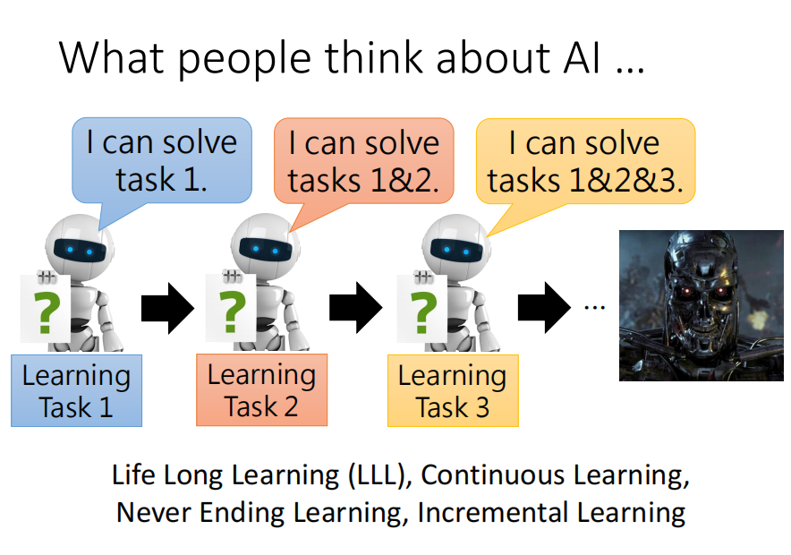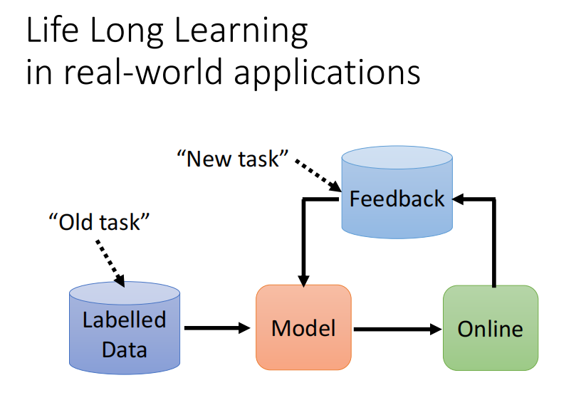

### 1.灾难性遗忘(Catastrophic Forgetting)

***

#### 1）是不为也，非不能也。

我们发现对于一个Domain的数字识别问题，当我们在左图任务1中训练之后，我们在任务一和任务二的数据上都有比较好的结果，但是，当我们拿任务一得出的模型去训练任务二的数据之后，发现任务二的正确率提升了，但是机器`遗忘`了任务一的训练。

那么是不是机器不能同时对两个问题进行训练呢，我们如右图将两个任务的数据集一起进行训练，发现正确率都相当不错。所以机器不是说不能同时识别两个问题。

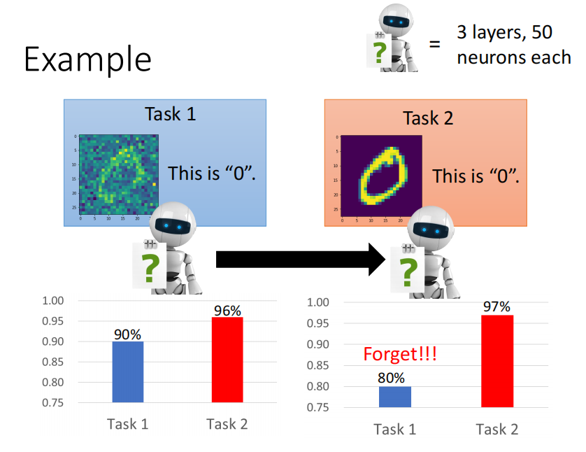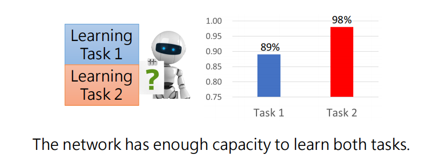

另一个例子是关于QA的例子，我们有20个不同的问答数据，例如左图所示。

右边的两个图分别是我们按照顺序一次训练问题1-20，问题5的正确率的情况，和将二十个问题一次性全部训练之后，每一个问题所对应的正确率。

我们发现顺序学习的方式，在学习问题6之后，问题5就被遗忘了。

但是一次性学习了20个问题之后，除了比较难的一些问题，但是每个问题其实都有较好的解决正确率。

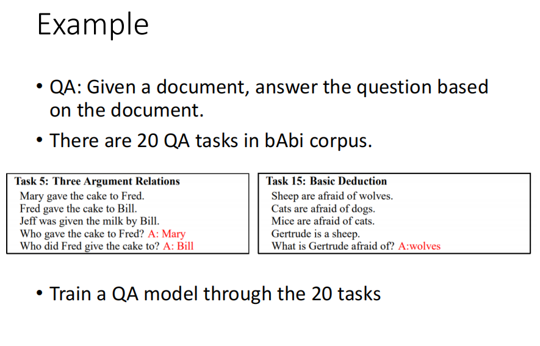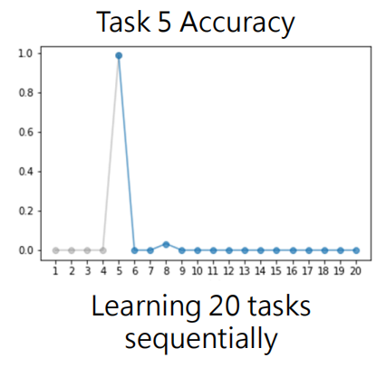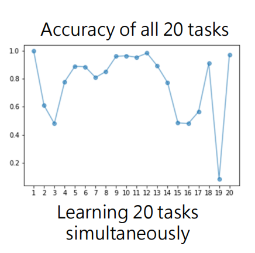

上面的遗忘的问题就是`Catastrophic Forgetting`。

一种解决方式是之前的把所有数据放在一起训练，即`Multi-task多任务`，我们也可以在训练了前999个数据之后，要训练第1000个数据的时候，把前999个数据倒入第1000个数据中。

这种方式相当于我们一直背着旧的数据，所以负担会很大。

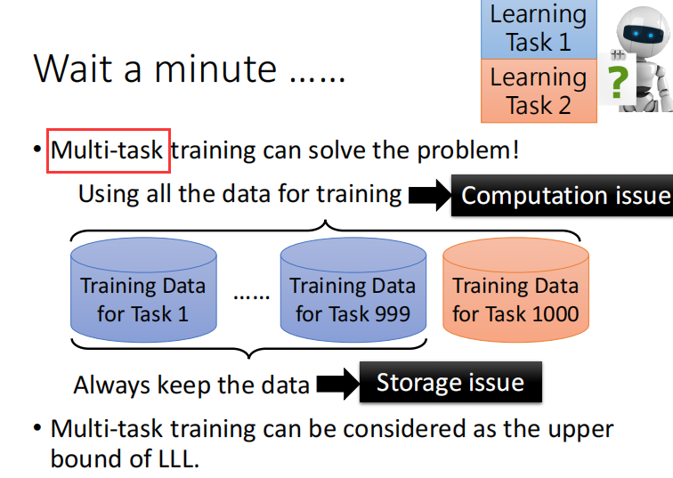

如果每个问题分开学一个模型，那么当问题数量非常多的时候就不能实现了。而且不能实现各个问题见的互通有无。

`Life-Long learning`关注的是学完第二个问题之后还能不能解决第一个问题，即旧的任务怎么样。

`Transfer learning`关注的是第一个问题的学习在第二个问题上的效果怎么样，即新的任务怎么样。

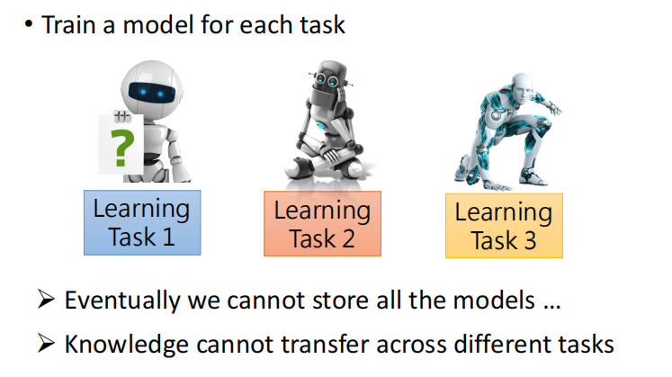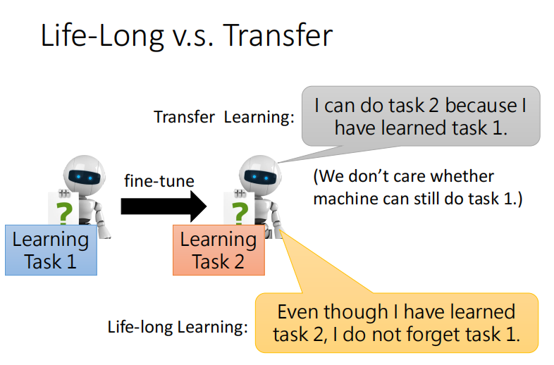

#### 2）Evaluation评估

我们常用的评估方法有下面两个。

Ri,j指的是Life-Long learning训练完第i个任务之后训练任务j的准确率，例如，R3,1是训练完第3个任务之后在第一个任务上的正确率。如果 i < j 的话，就相当于是在新的任务上的效果，也就是上面的Transfer learning。

左图所示是`Backward Transfer`的计算方式，使用每一个最后训练完第T个任务之后的结果和第i个任务的训练准确率做差求和，由于遗忘的存在，所以往往这个结果最后是个负数，我们只需要让这个负数尽可能别太负即可。

右图所示是`Forward Transfer`的计算方式，通常是想要还没有看到任务T的时候，任务1到任务T-1学习任务T到底会得到怎样的结果。

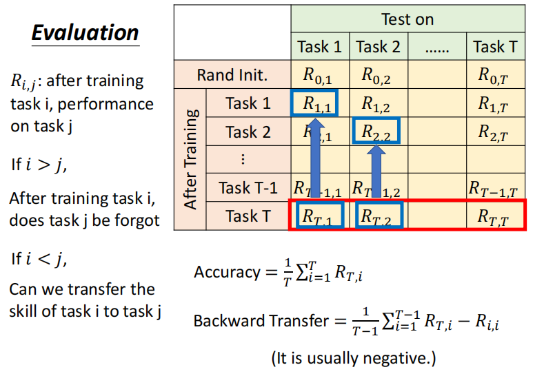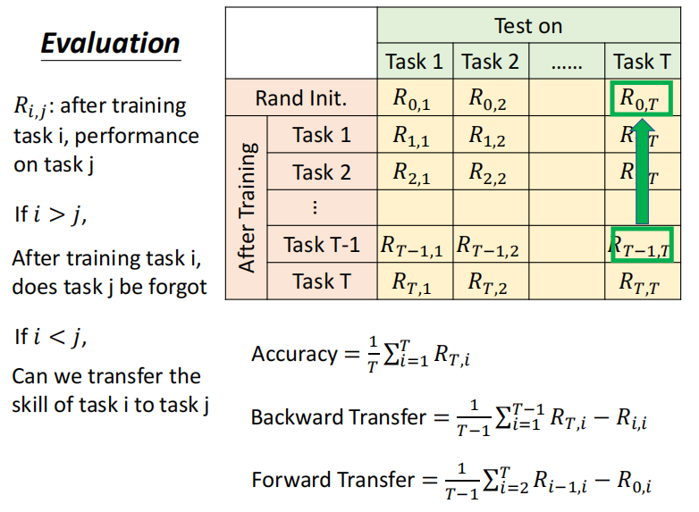

### 2.Life-Long learning的可能解法

#### 1）Catastrophic Forgetting的原因

如下图所示是两个误差平面(error surface)，比如我们起始参数为θ0的时候，我们训练任务1，使得参数更新为θb，我们用θb去训练任务2，参数最终更新为θ*，相当于是逐步训练了任务1和任务2。当我们用θ星去测试任务1就发现出现了遗忘问题。

注意：下图中白色表示误差大，蓝色表示误差小。

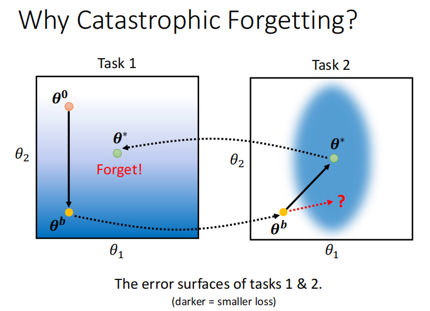

那么，我们要是在训练任务2的时候让θb沿着红色箭头方向去更新参数，那么再次应用在任务1的时候遗忘就会小一点。

#### 2）解法一、部分神经元具有可塑性(Selective Synaptic Plasticity)

我们在逐渐的学习过程中，有的参数可能比较重要，有的参数可能不是很重要。

我们对每一个参数θ都有一个各自的保镖b，用来表示这个问题在旧的问题上是否重要。我们**新的Loss损失函数**如下图所示。

θi 是我们`期望的参数`，θbi 指的`之前的所有问题训练之后的参数`。两个做差得出两个参数的差距，再通过bi表示该参数的`重要性`，**越重要**bi越大，做乘法之后两个参数越的差距越重要。**越不重要**bi越小，就是参数的差距是多少不重要。

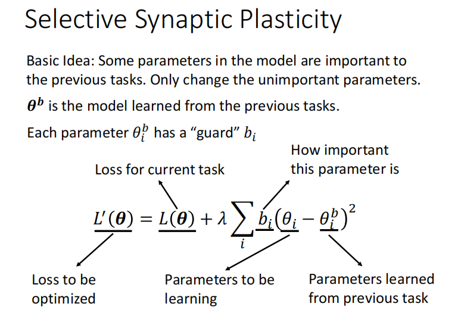

如果bi全部设成0，那么就是所有参数都同等重要，就是一般的情况，会出现遗忘问题，即`Catastrophic Forgetting`。

如果bi全都非常大，那么我们可以在旧的任务上得到比较好的结果，但是可能无法对新的任务训练好，即`Intransigence`。

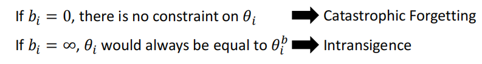

判断一个参数是否重要，即确定bi。

简单来说就是训练一次之后我们对于θb中的每个参数在`各个参数方向移动对Loss的影响`。例如θb1在θ1 方向上水平移动，我们发现对Loss的影响是小的，所以b1就可以小一点。同理我们发现在θ2的竖直方向上移动，对Loss的影响是大的，所以b2应该设的大一点。   

按照上面小的b1，大的b2，我们的训练结果可能就如右图所示，就没有出现遗忘的问题。

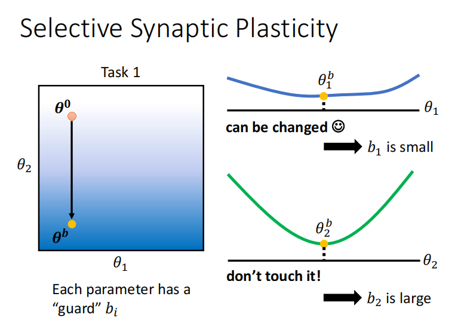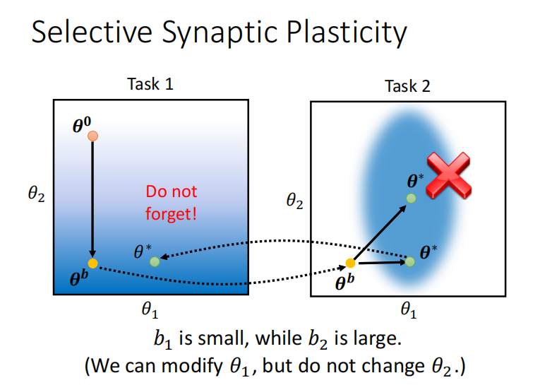

#### 3）解法二、改变在每一个网络架构中的资源(Additional Neural Resource Allocation)

`Progressive Neural Networks`的想法是，比如我们训练了任务1之后，在训练任务2的时候我们不动任务1结果的参数，添加一些新的参数，训练任务3再添加一些新的参数，最终也可以避免遗忘问题。

但是会造成的问题就是每次多训练一点，模型就会需要更多的空间，最终可能存不下。

`PackNet`的想法是，我们参数的总量是不会变的，但是训练任务2的时候不会使用任务1用过的参数，训练任务3不会用到任务1和任务2用过的参数，这种方法也可以不会导致遗忘问题，但是其实也就是提前把参数用完了而已。

如果结合Progressive Neural Networks和PackNet，我们得到一种叫`CPG`的结构，我们的模型既可以增加参数每次也可以保存一部分参数。

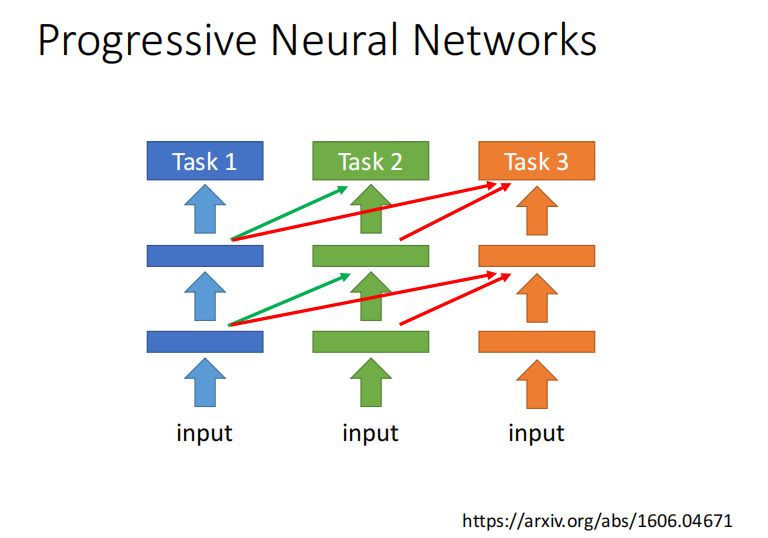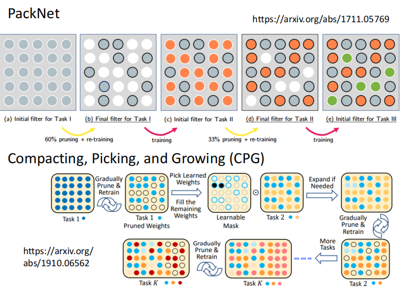

#### 4）解法三、节省内存(Memory Reply)

`Generating Data`的想法是，我们既然不想背着之前的数据走，但是有时还需要之前的数据，所以我们可以在训练完任务1之后，执行一个`Generate`产生一些任务一的数据(这个比直接带着任务1的数据走小很多)，然后训练任务2的时候，不止是使用任务2的数据，还要使用任务1Generate后的数据。

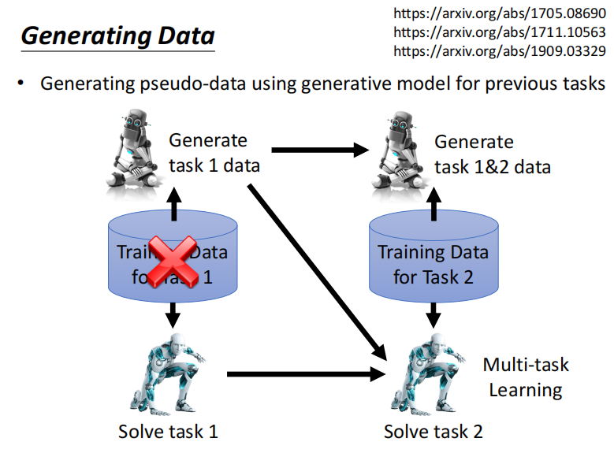

#### 5）执行顺序(Curriculum Learning)

当我们对`任务的执行顺序`发生变化的时候，也许遗忘问题回产生不一样的结果，所以研究任务执行的顺序也是个很有效解决遗忘问题的研究。

如下图所示，如果先训练任务2，再训练任务1，神奇的事情发生了，遗忘问题就消失了。

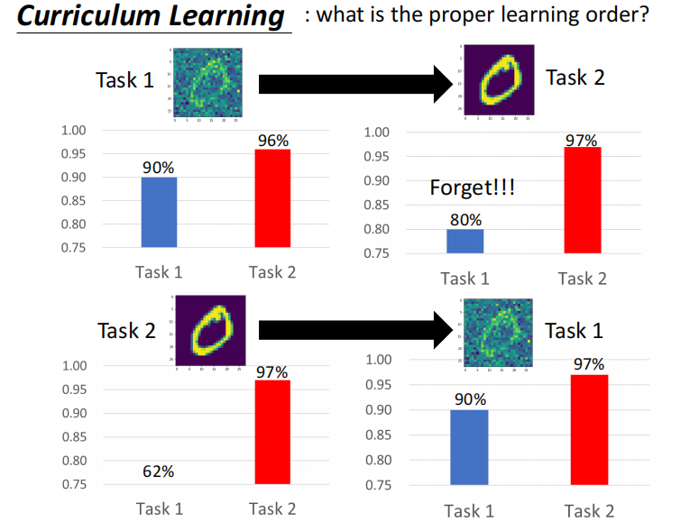