# 2021李宏毅机器学习课程

## 第十二部分、网络压缩(NetWork  Compression)

当我们在实际使用网络架构的时候，有时会需要对网络进行压缩，比如我们想让一个智能手表或者无人机去运行一个机器学习。

有时我们让手表或者其他设备自己运行机器学习，而不是在云端的一个BERT上运行之后返回一个结果即可的原因可能是，我们的设备需要及时的结果，或者我们的数据可能是隐私的，不希望云端看到我们的数据。

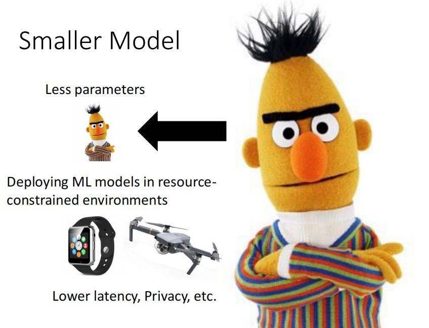

### 1.网络修剪(Network Pruning)

***

#### 1）修剪参数 / 修剪神经元

`Network Pruning`的想法是我们通过删除一些不重要的参数或者神经元对网络进行压缩。

左图，所示的是一个网络修剪的过程，我们在修剪完之后往往模型的效能会变差一点，所以我们通过Finu-tune进行一些微调，再提升一点修剪后的模型的性能。

中间图，所示的是一个**删除参数**的过程，由于删除一些参数之后使得我们的架构变得不整齐（GPU加速实际上是把NetWork看作是矩阵乘法），所以剪掉的部分我们通常补零。问题就是**我们实际上并没有把NetWork变小**，实际上还是存了所有的参数，只是有的是0而已。

右图，所示的是我们逐渐去掉参数之后我们发现，最终能够去掉95%的参数，但是速度并没有提升。

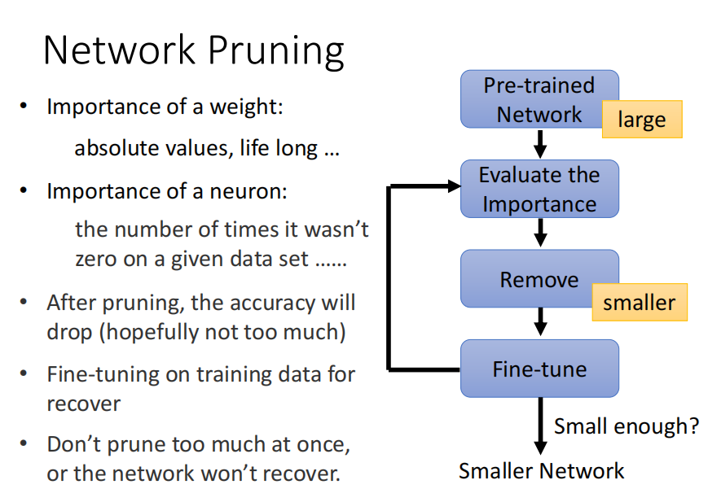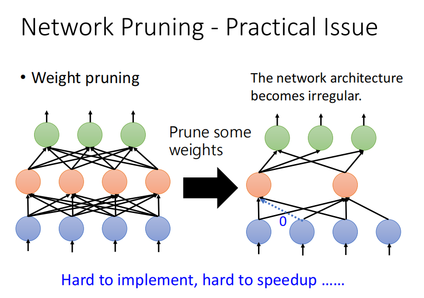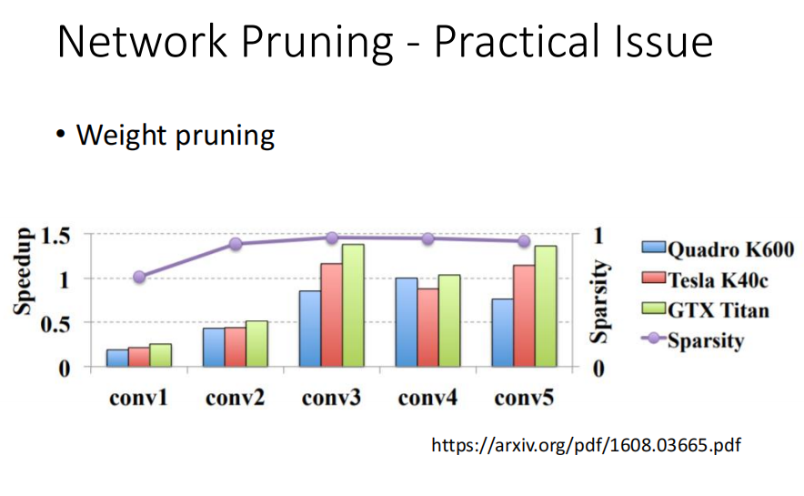

如果我们通过**删去一部分神经元**的方式压缩网络，不会使得网络的结果不完整（仍然可以使用GPU进行矩阵乘法），而且也相对比较容易实践，只需要在写pytorch的layer的时候少写一点就可以。

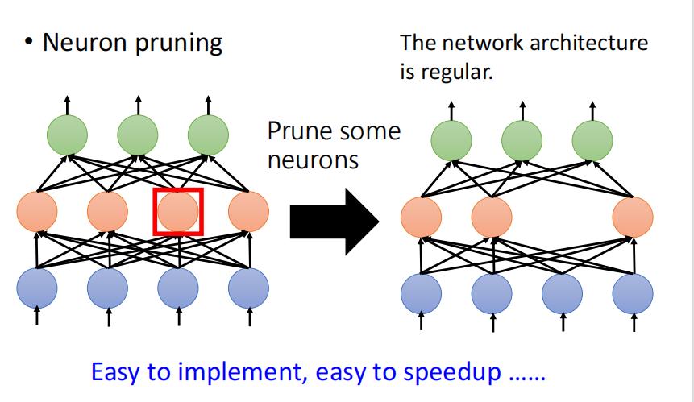

#### 2）LT假说(Lottery Ticket Hypothesis)

LT`假说`指的是，如果我们有一个大的Network，我们把他理解为很多小的network的组合，那么这些小的network只要有一个得到了好的结果，那么我们大的Network就可以得到好的结果。类似买彩票，只要我买的一盒里面有一个大奖，我就赚翻了。

右图所示，指的是如果我们对一个大的Network训练之后剪掉了一些部分得到小的network，如果我们把这个小的network复制一份出来。**重新初始化参数训练**，效果会非常差。但是如果**仍然使用之前大的network的参数**，效果又会很好。

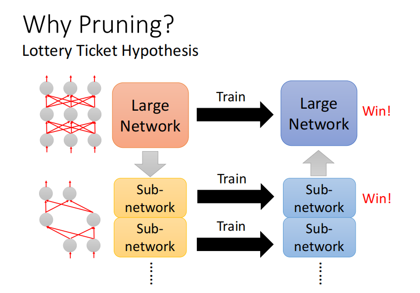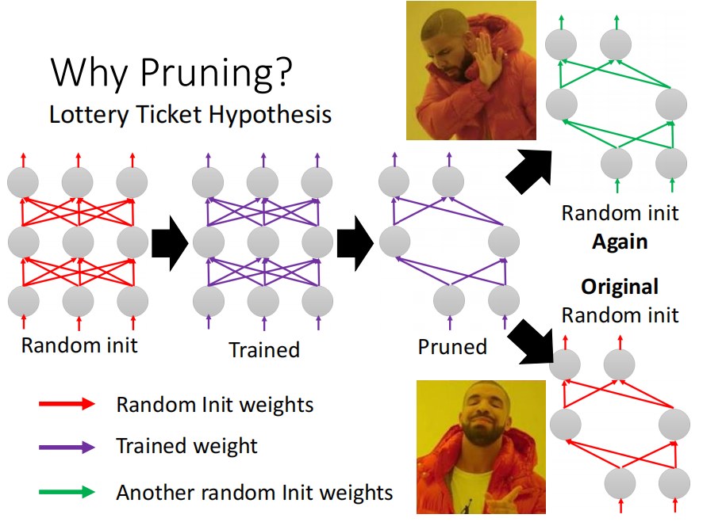

上面这个目前只是假说，也有反驳他的例子。

### 2.知识升华(Knowledge Distillation)

***

由于考虑到直接训练一个大的Network结果会比训练小的network要好，所以我们先训练一个大的Network作为Teacher Network，然后`Knowledge Distillation`的思想是我们在训练小的network的时候不用真实的结果作为目标y，而是用Teacher Network训练得出的结果作为Student Network的目标y。

而且，使用Knowledge Distillation的方式，当我们通过Teacher Network训练了数据集之后，比如得到了"1"，"7"，"9"是有点类似的，那么我们拿这个结果去训练Student Network，会比直接拿数据集给Student Network训练要好，甚至说假设Student Network里面根本就没有数字"7"和"9"，他也可以根据Teacher Network的学习结果学到"7"和"9"的相关知识。

并且，Teacher Network也可以是多个模型的输出平均值或者投票的结果。

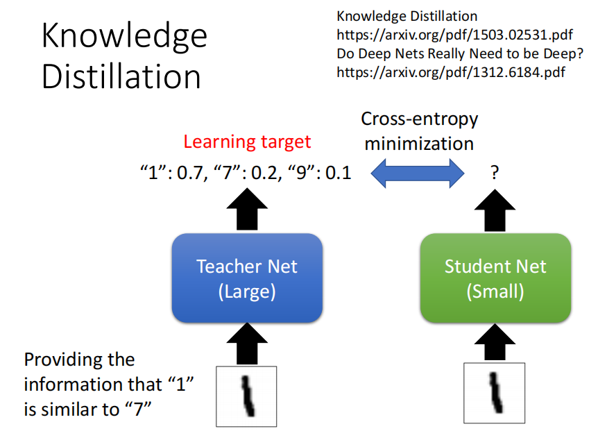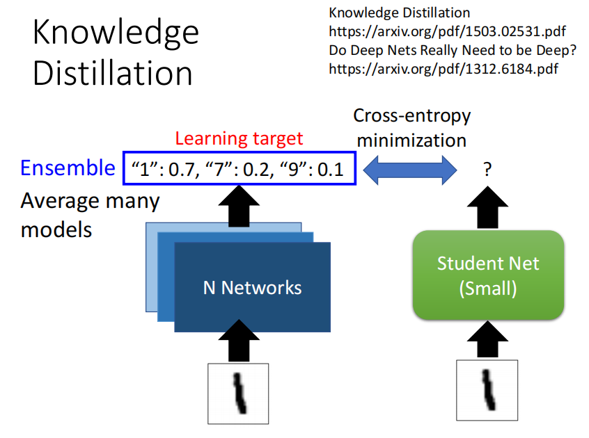

在Knowledge Distillation中使用`softmax`的时候我们每个yi多除以了一个`T(Temperature)`，目的是让本来分布比较**集中**的数据分布的**平滑**一点。

例如，下图所示的如果是右边的情况的话，相当于Teacher训练的结果比较集中，他并没教会Student什么知识，而右边的除以了T之后Teacher就会得到分布不那么集中(平滑)的结果，这样再去让Student学习的时候效果往往是比较好的，并且能够保留原始数据的分布情况。

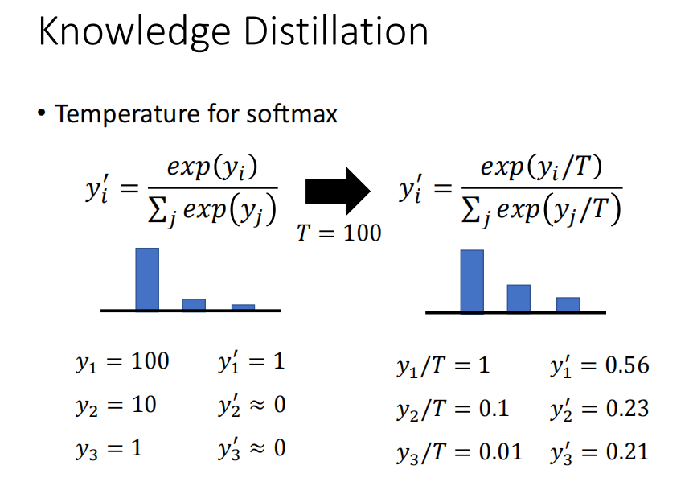

### 3.参数量化(Parameter Quantization)

***

首先，`Using less bits`是我们可不可以用`比较少的空间储存参数`，比如原来是64bit的参数我现在用32bit来存是不是就够了。

其次，`Weight clustering`是我们对于不同的参数`分群`，例如下图同一个颜色为同一个群，在每一个群中找一个数字代表这个群，由于同一个群的参数数值都差不多，所以我们用-0.4来表示黄色的群之后，所有原来黄色的部分都看作是-0.4。这样假设我们分成两个群，用2bit就够了。

最后，`Huffman encoding`指的是，对于经常出现的东西我们用较少的参数表示，不经常出现的东西用较多的参数表示。

最终极的情况是最后一个图的用`二进制(Binary Weight)`的形式表示所有的参数，即每个参数不是+1就是-1，最终由于参数的变化比较少了不会导致过拟合问题，所有训练模型也许效果也可以很好。

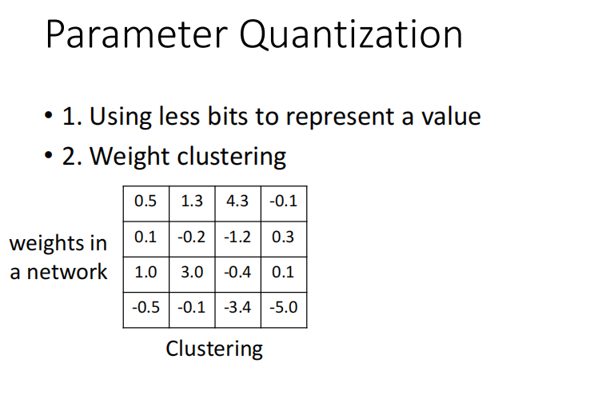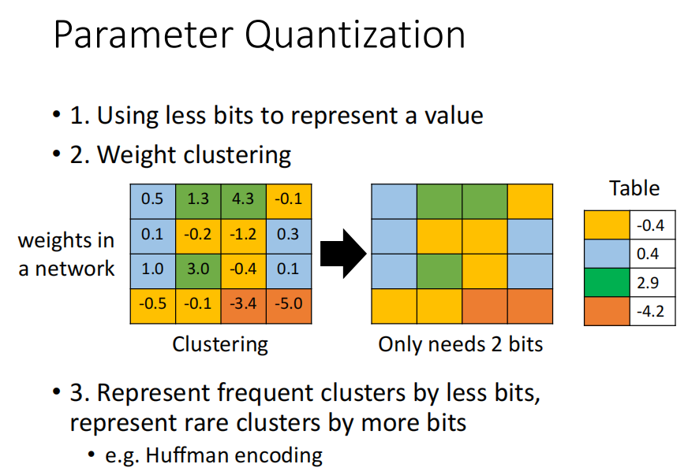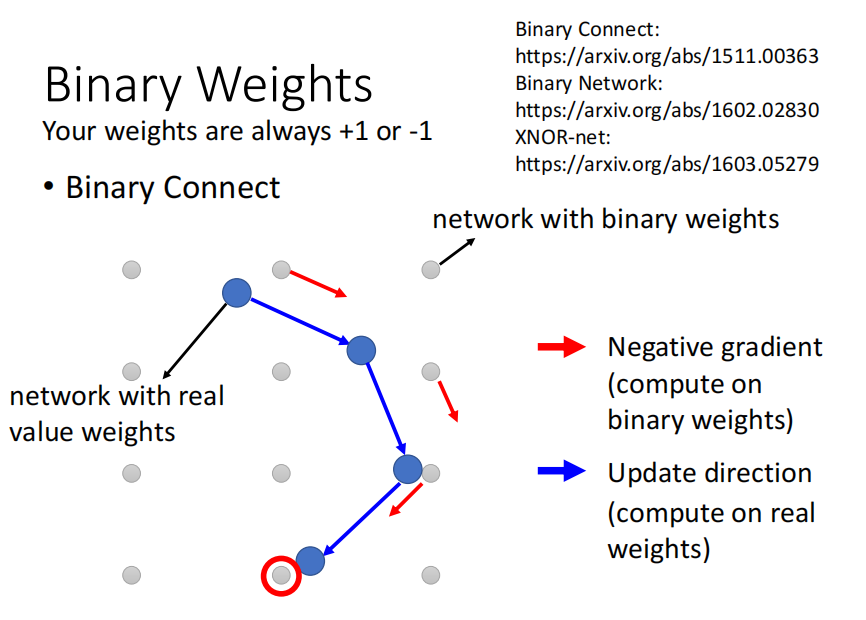

### 4.体系结构设计(Architecture Design)

***

我们可以使用下面的前四种方法来减少参数的量从而压缩网络，最后一种方法是动态调整计算量的方式压缩网络。

注意：下面的这些方法在每一个实际问题中不一定每次只使用一个方法，也可以多个混合使用。

#### 1）Depthwise Convolution

`深度可分离卷积(Depthwise Separable Convolution)`就是一种通过**修改网络的结构**来减少参数量的方法。

第一步是`Depthwise Convolution`，即我们的Input有几个channel，我们就设计几个filter(卷积核)，而且每个filter负责一个channel。

最终我们发现使用Depthwise Convolution的方式最终输出的channel和输入channel是一样的。

但是这种方式我们的channel之间没有**互动**，所以我们添加了一个1x1的filter叫做`Pointwise Convolution`，他只负责考虑channel之间的关系，不需要考虑每个channel上的情况。

我们使用Depthwise Convolution + Pointwise Convolution最后得到的Output的大小就是如最右边图所示**1 / O + 1 / k x k**。有时O很大比如512*512，所以O很大的时候只用1 / k x k 表示即可，例如k = 2时，输入512 x 512的图片最后我们得到 512 x 1 / 4 = 128的输出。

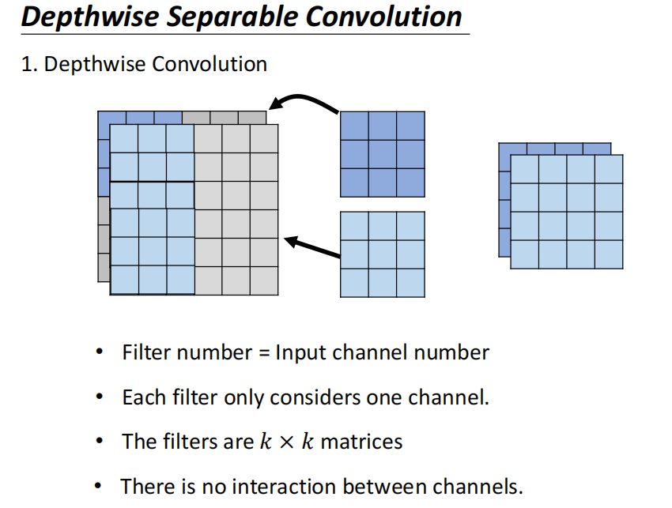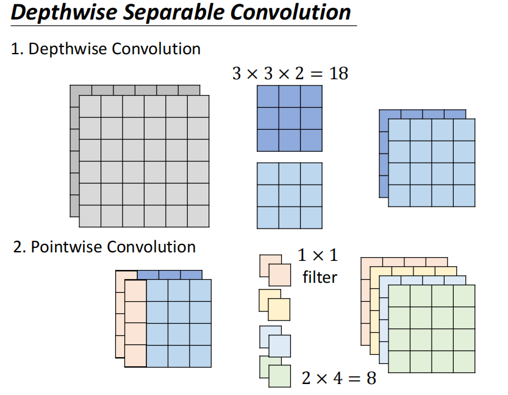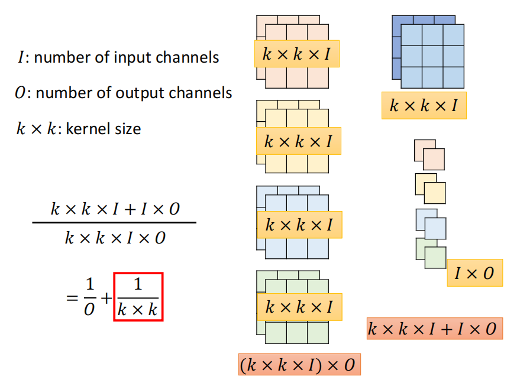

#### 2）参数量近似(Low rank approximation)

Low rank approximation参数量近似的想法是，假设我们有两层layer参数量合起来是N x M，我们可以在**中间加一层**来减少参数量。

比如左图所示，中间加了一层参数量为k之后，从下面到上面的layer的参数量就变成了N x K + K x M = K x (N + M)，所以当K取一个比较小的值的时候我们就可以减少参数量，但是存在的问题就是**降低了layer之间的参数的可能性**。

右图所示的是使用了Depthwise Convolution + Pointwise Convolution的方法减少参数量的情况，也是把原来的两层18个参数变成一个参数的情况改成了，先变成两个9的参数，再合成一个参数，也是通过添加步骤来减少参数量。

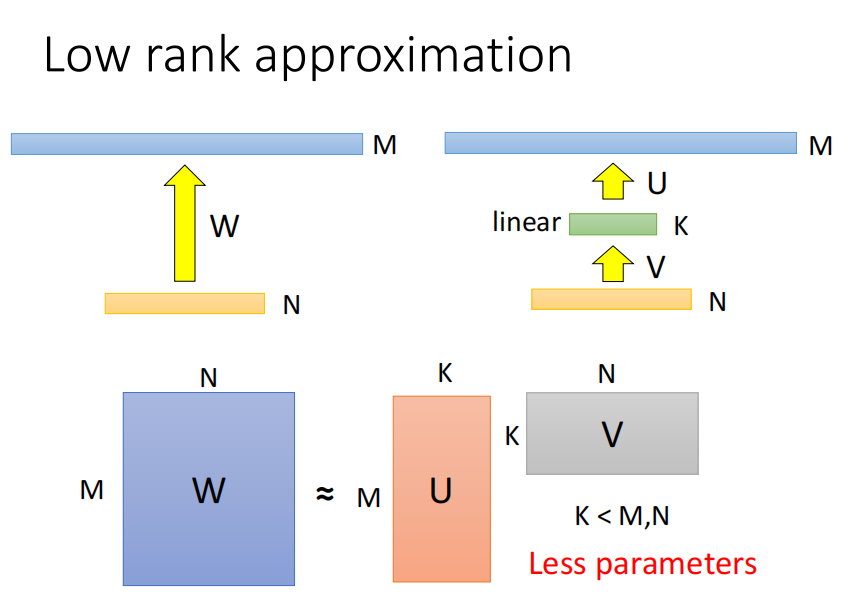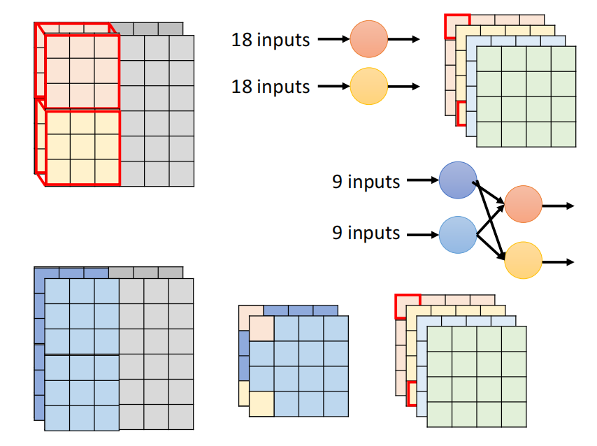

### 5.动态计算(Dynamic Computation)

***

`Dynamic Computation动态计算`与之前四个想法不同，之前四个想法的意思是减少参数的数量，而Dynamic Computation是希望网络能够在运算中**自由地调整运算量**。

因为有的时候我们用一个Network可能跑在不同的设备上，如果我们可以动态地调整运算量，那么就不需要去修改我们的Network。

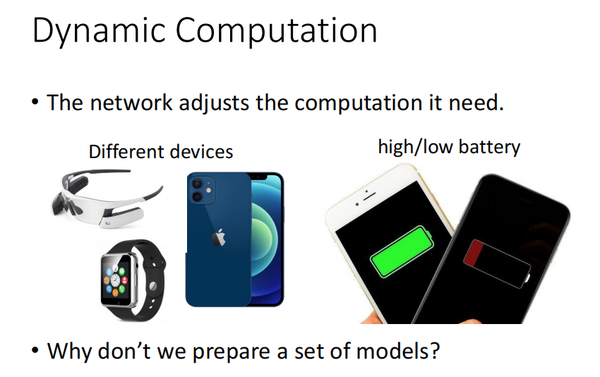

#### 1）动态调整深度(Dynamic Depth)

我们可以在每两层layer之间加一层额外的layer即Extra layer，用来表示上一步执行之后的分类结果，当运算量不够的时候我们就让他在能够使用的layer之后输出分类结果即可。

更新参数的时候我们只需要把每一个分类结果和真实结果求e，再加起来然后最小Loss即可。

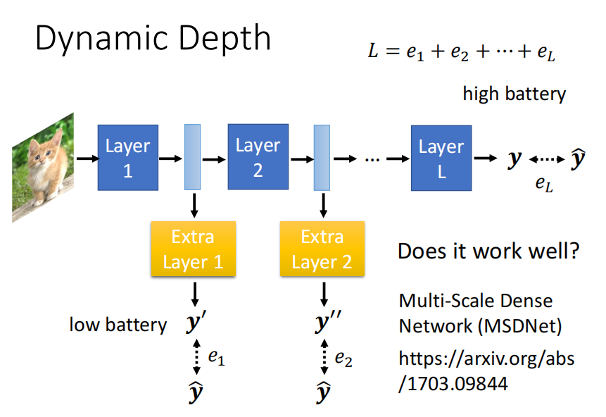

#### 2）动态调整宽度(Dynamic Width)

如下图所示，我们在运算量不同的时候让网络自行决定宽度。

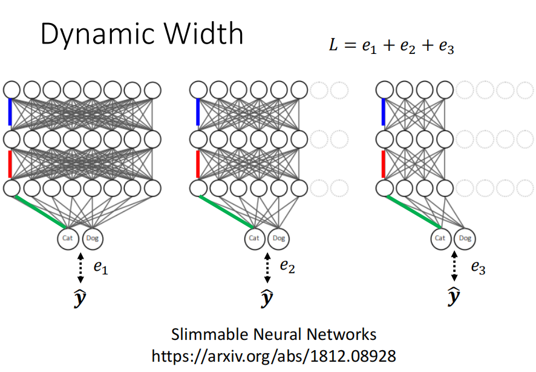

#### 3）让机器根据问题难易程度自行决定(Computation based on Sample Difficulty)

如下图所示，让机器对于简单的问题使用较少的层就得到结果，而对于较复杂的问题就多用几层。

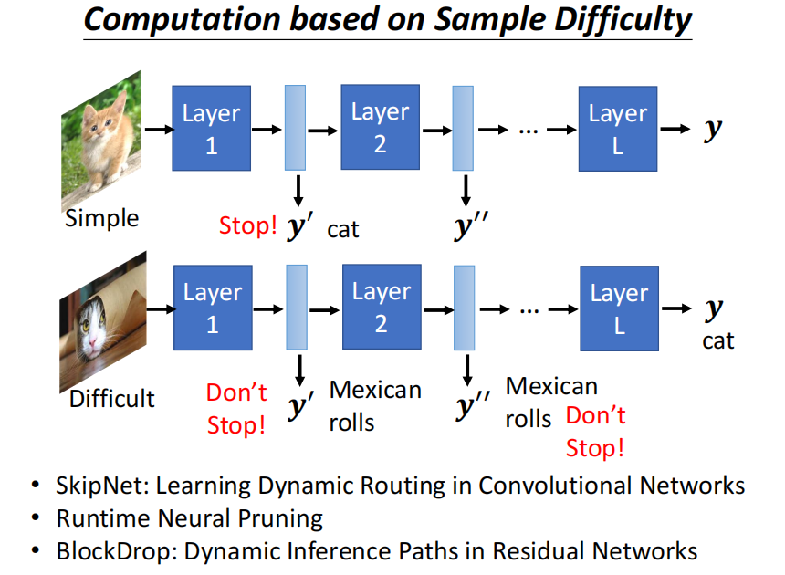

