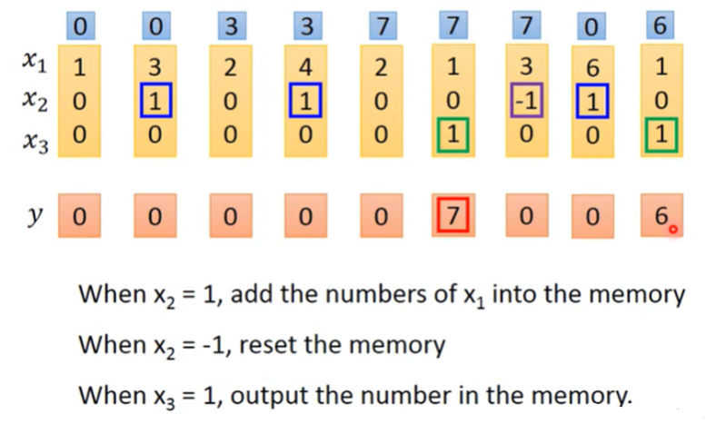

# 2021李宏毅机器学习课程

## 第十四部分、循环神经网络（Recurrent Neural Network）

`RNN`是由记忆力的Network

### 1.应用示例（Example Application）

***

#### （1）订票系统示例

首先是一个简单的位置填充(slot filling)的例子，假设有一个用户对某个车票订票系统发送了一句**“I would like to arrive Taipei on November 2nd”**，那么系统需要做的就是从这句画中识别出来Taipei属于**目的地**(destination)这个slot，二November 2nd属于**抵达时间**(Time of arrive)这个slot，其他词汇不属于任何一个slot，或者让他们统一属于others。

下面是两种比较常见的表示所示slot的方式，第一张图是简单的`1-of-N encoding`，第二张图中是一些其他的使用方法比如除了所需划分的类别，额外添加了`others`，比如用`词序的出现顺序`最终确定所属类别。

#### （2）前馈神经网络(Feedforward network)

那么如何解决这个问题，我们的想法就是用`前馈神经网络(Feedforward network)`来解决，如下图左图所示，输入是一个词汇，输出的是每一个词汇属于每一个slot的概率分布(Probability distribution)，类似分类问题，我们在这里最后用的也是**交叉熵损失函数**，输入的词汇需要用**向量(vector)**的形式来表式。

而右图所示的是使用这种简答的前馈神经网络存在的问题，以订票系统为例，我们订票的时候有时是**`arrive` Taipei on November 2nd**有时是**`leave` Taipei on Novmber 2nd**，这就要求我们的神经网络能够保存(记忆)在Taipei之前的是arrive还是leave，而这种有**记忆力**的神经网络就叫做RNN(Recurrent Neural Network)

#### （3）RNN(Recurrent Neural Network)

在RNN中，我们每次hidden layer的神经元产生的输出都会存储在一个memory中，对于下次的输入，hidden layer的神经元不只是考虑输入的x1和x2还会考虑之前存在memory中的值。

例如下图所示，我们在最开始使用RNN的时候先给他一个**初始值**，RNN会根据input sequence的**次序**产生输出，当次序发生变化的时候输出的结果也会变化。

实例中假设所有的权值w都为1且没有偏置值bias，首先输入[1,1]，由于第一次memory初始值为0，所以结果是[4,4]同时将神经元中的[2,2]存储在了memory中，下次输入[1,1]，就会与memory中的值进行相加得到输出是[12,12]以此类推最后一次的结果是[32.32]

下面左图所示的，就是一个简单的RNN的实现，注意这里并不是三个network而是同一个network被使用了三次，同一种颜色表示使用的是相同的weight。我们按照句子的顺序依次输入对应的词汇的vector到相应的网络中去，并将结果存在memory里面，和下一个输入一起运算。

下面右图所示的，就是如何解决上面提到的订票系统区分**arrive**和**leave**的问题，我们虽然输入的x2都是一样的Taipei但是x1不同，所以根据输入的**次序**不同，输出的结果不同，我们就可以区分出是目的地还是出发地的问题。

### 2.Elman Network & Jordan Network

***

`Elman Network`就是指把hidden layer的值存储起来，在下一个hidden layer的时间点读出来。而`Jordan Network`存储的是network的输出output的值，并且实验发现**Jordan Network能得到较好的表现**。因为在Elman Network中hidden layer存储的内容是没有**target**的，无法控制他学习什么东西放到memory里面，而在Jordan Network中存储的内容是有**target**的，我们比较清楚放到memory中是什么东西。

### 3.Bidirectional RNN

***

`Bidirectional RNN`指的是双向的RNN，意思就是我们的输入句子可以从头读到尾，也可以从尾读到头，这样的好处就是我们在训练RNN的时候**同时**训练一个**正向RNN**和一个**逆向RNN**，我们最后的输出结果就会是**既考虑了前，又考虑了后**的一种能看到整个句子的结果。

### 4.Long Short-term Memory（LSTM）

***

**上述提到的RNN都是`简单RNN`**

而现在最常用的RNN的memory是`LSTM(Long Short-term Memory)`，这种network的结构比较复杂，有三个**大门(gate)**进行把守。

* input gate
* forget gate
* output gate

当外界的输入想要进入到memory中的时候，必须input gate打开才可以进入，当output gate打开的时候运算的结果才可以输出，当forget gate打开的时候我们保存结果，而当forget gate关闭的时候我们清空存储的内容。

注意：三个gate的开/关都是由network自己学的

因此一个LSTM可以看作是四个输入（想要存入memory的值+3个gate的值），一个输出的network。

下面我们更加直观的可以展示一下LSTM的结构。其中Zi、Zf、Zo这3分别表示3个gate的值，都是通过采用**sigmoid function激活函数**得到的值，因为sigmoid的值介于0到1之间。如果值为1，代表gate被打开，反之，则gate被关闭。

### 5.LSTM – Example

***

如下图所示，我们将输入的值用一个三维向量表示，输出是一维向量。x2用于控制**forget gate**，当x2 = 1时，就把x1的值加到memory里面；当x2 = -1时，就把memory清为0。x3用于控制**output gate**，当x3 = 1时，就把memory里面的值输出。

下图所示，表示的是我们给3个gate分别设定的一些**权值**(只是个例子)，**forget gate**通常都是打开的因为x2的权值是100，只有当x2=-1的时候才会清除记忆。**output gate**通常都是关闭的因为bias=-10，只有当x3=1的时候才能盖过-10输出结果。

我们发现上图中所有的gate都是用给出的输入[3,-1,0]和权值相乘，其实在`Original Network`里面，我们有很多的神经元。现在把input乘上不同的weight，然后当作neuron的输入，每一个neuron都是一个function，输入一个标量scalar，输出另外一个标量scalar。而在`LSTM`中我们只是将神经元换成了LSTM的结构而已，所以假设LSTM和Original Network的神经元数量相同的时候，LSTM所需的参数量一般会是普通神经元网络的**4倍**。

下图所示的是一个假设n个LSTM，向量ct-1表示上一个LSTM中的memory的值。

* 首先将xt做一个线性变换，和矩阵做乘法，每一个维度作为控制LSTM的用于存入memory的值，所以z的维度就是LSTM的memory的值
* 然后同理xt和其他三个矩阵做乘法，维度分别用来控制input gate、forget gate、output gate。

即，将xt乘以四个不同的transform得到四个不同的矩阵，用不同维度来分别4个输入。

具体过程如下图所示，这个地方只是一个**最简单的LSTM**的过程。

其实真正的LSTM会把每一个LSTM的**输出部分**接入到下一个LSTM的输入部分(**ht**)，而且还会添加一个`peephole`就是把存在**memory Cell**里面的值也拿过来，作为LSTM下一时刻输入的一部分。

通常的LSTM都会有**六层**，看起来就是一个很复杂的模型，但是实际情况跑出来的结果还是蛮好的。

### 6.Learning Target

***

#### （1）Loss Function

如我们所知，在设计出一个模型之后，我们想要评估模型的好坏就需要定义loss function。在RNN中我们以之前提到的订票系统为例，已知这是一个要判断最终的slot filling的问题，我们可以类比分类问题，将输出的y与slot中的真实向量做`交叉熵(crossentropy)`。然后这个交叉熵的结果就是我们要minimize的对象。

注意：句子里面的词语必须按照语序输入，不能打乱语序。

#### （2）Training

在RNN中我们做训练使用的也是`梯度下降(gradient descent)`的方式，这里采用了`BPTT(Backpropagation through time)`可以考虑到时间的因素。

但是RNN想要train其实是比较困难的，我们实验发现随着epoch的增加，loss并没有像我们期望的那样沿着**蓝色**的慢慢下降，而是像**绿色**的线那样出现变化非常剧烈的情况。

当我们如下图右图所示，把RNN的error surface可视化出来之后我们发现，他是非常崎岖的，在某些地方loss非常**平缓**，而在某些地方loss非常**陡峭**。假设橙色的点是起始点，在梯度下降更新参数后，可能会出现从平缓的地方更新到了陡峭的地方。

**最坏的情况**就是之前一直在平缓的地方更新参数，于是gradient非常小，机器把learning rate调整的比较大，突然一脚踩到陡峭的地方，gradient就会变得很大，整个模型的参数更新之后就会飞出去。

提出的解决方法就是`clipping`，当我们的gradient大于某个额定值之后，我们就用额定值来代替当前的gradient，例如额定值设定为15，当gradient＞15时，gradient = 15。

### 7.Why?

***

那么为什么会出现这样的问题，我们观察RNN的结构就会发现，他其实

* 同样的东西在不同时间反复使用（权重w累乘）
* 造成了梯度爆炸或者梯度消失

观察下面的图片我们发现当w=1的时候计算y1000实际上就是999个w累乘结果是1，但是当w=1.01的时候，y1000 ≈ 20000，此时的L对w的微分值很大，我们需要较小的learning rate。**（梯度爆炸）**

而w<0的时候我们同理可发现，由于多次累乘，最后结果都趋于0，此时的L对w的微分值很小，我们需要较大的learning rate。**（梯度消失）**

### 8.Helpful Techniques

***

解决掉上面的RNN的问题我们使用的是`LSTM`，因为它会把error surface平坦的地方去掉，从而解决掉**梯度消失(gradient vanshing)**的问题，但是它无法去除崎岖的地方，所以无法解决**梯度爆炸(gradient explode)**的问题。

LSTM能够解决问题的理由是

* 在LSTM中不同的memory之间**累加**
* 除非forget gate清空memory，否则之前的极度下降更新出来的结果一直存储在memory中，不会消失。

即，在RNN里面，在每一个时间点，memory里面的信息都会被清理掉。在LSTM里面，会把原来memory里面的值乘上一个值，然后再加上input的值放到Cell里面。对LSTM来说，除非forget gate被使用，否则不会把memory之前的信息给清除掉。

另外一个方法就是`GRU(Gated Recurrent Unit)`只有两个gate操作memory，需要的参数少，不容易过拟合。它秉承的是只有memory里面的信息被清除掉，才会新的信息给添加进来。

* 相比于LSTM，少了一个门。
* 当 input gate 打开时，forget gate 就自动关闭。

其它：**Clockwise、SCRN（Structurally Constrained Recurrent Network）等**。

同时还有一些其他的有趣的实验结果是，当我们初始化方案不同的时候**激活函数**的选取将影响网络的性能，例如RNN中用的初始化是`identity matrix`的时候，将激活函数替换成`ReLU`效果会变好。一般的情况下还是`Sigmoid`做激活函数效果好。

### 9.More Applications

***

更多的应用，我们之前举的例子都是输入和输出的向量数是一致的，即输入几个向量就输出几个向量，但是其实RNN还可以做更多的事情。

#### （1）Many to one

例如在**情感分析(sentiment Analysis)**中，我们输入一段文章或者其他内容，最终我们只想得到这个内容是**正向(positive)**还是**负向(negative)**的。

我们将序列按照顺序在不同时间点输入，最后一个时间点把输出拿出来，经过处理，得到最后的结果。

或者也可以应用在**关键词提取(Key Term Extraction)**中，例如，给关键词系统一篇文章他会提取出文章中的关键词，然后把含有关键词的文章作为RNN的训练资料，如下图所示，我们输入一篇文章，先经过RNN之后我们把最后一个结果放到一个`attention`中考虑彼此之间的相关性，最终输出结果关键词。

#### （2）Many to Many(Output is shorter)

如果input和output都是sequence，但**output比input更短**，RNN可以解决这类问题。用语音辨识举例说明，输入一段声音讯号，每隔一段时间就用1个vector表示，现在使用Slot Filling来处理，得到识别结果是“好好好棒棒棒棒”，这与我们想要不同。

所以使用`Trimming`把结果**重复部分**清除掉，得到“好棒”。但是现在没法辨识“好棒棒”，可以用`CTC(Connectionist Temporal Classification)`解决问题，它就是在输出中加上NULL空字符，只需要去除空字符，就可以得到我们想要的结果。

并且Google现在的语音辨识系统已经更改为`CTC`为基础的算法。

#### （3）Beyond Sequence

我们同样可以将树状图描述成一个序列，作为目标值进行训练。

#### （4）Sequence-to-sequence Auto-encoder-Text

输入语句的**次序**很重要。完全相同的 bag-of-word ，其意义是完全不同的。

我们同样可以将输入的语句最后一个时间点的输出作为`encoder`，然后放到`decoder`中去还原语句。输入原句，Encoder输出嵌入后的向量(Embedding Vector)，再将嵌入向量输入解码器Decode，争取让解码器输出原句，则编码成功。

我们不需要对数据进行打标签，只需要大量文章就可以训练。

这个结构可以是**分层(hierarchical)**的，如上是4层的LSTM组合。

#### （5）Attenttion-based Model

基于注意力的模型，我们可以类似**人脑**，机器也有一个用于记忆的**缓存区**，可以在使用神经网络时，进行读和写的操作。

这个叫做`Neural Turing Machine`。

#### （6）其他应用

比如做阅读理解，视觉的问答，语音的问答等等。

### 10.RNN v.s. Structured Learning

***

根据下图我们可以直观的看到RNN与结构化学习方法的一些各自的**优势**。

* 结构化学习能够使用完整的句子，但是RNN考虑不到完整的句子
* 结构化学习的label标签的依赖性比较明确，例如结构化学习我们可以让他连续产生某一个label五次就终止，而RNN没有办法做到。
* 结构化学习的cost是error的上界，但是RNN中cost和error没什么关联，因为RNN是每一个时间点计算一次cost，而最终的error可能是两个完整的句子之间的差距。
* 但是**最重要**的一点是RNN可以用来做`Deep`，但是结构化学习往往很难Deep，所以RNN往往效果优于结构化学习

其实我们也可以把RNN和结构化学习结合在一起使用，例如input的feature先通过RNN和LSTM(可以做deep)，RNN和LSTM的output再作为HMM等结构化学习的input。**二者可以一起 Learn 的，一起梯度下降。**

常见的结合例如：

* Speech Recognition: CNN/LSTM/DNN + HMM
* Semantic Tagging: Bi-directional LSTM + CRF/Structured SVM

李老师认为结构化学习本质上就是一个`GAN`的过程，所以他可以用GAN的方法进行实现。

